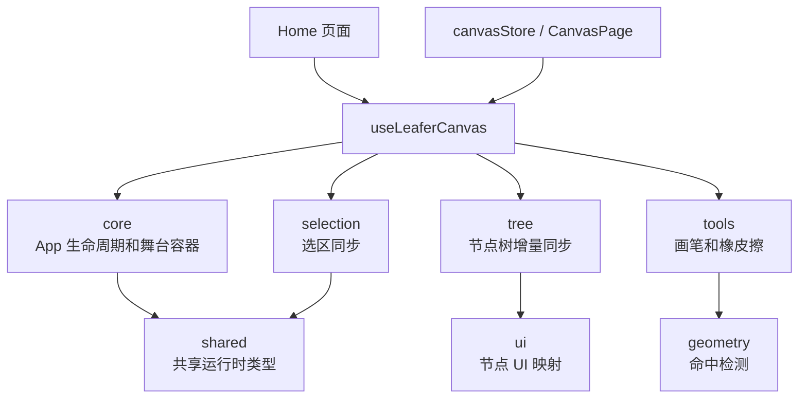
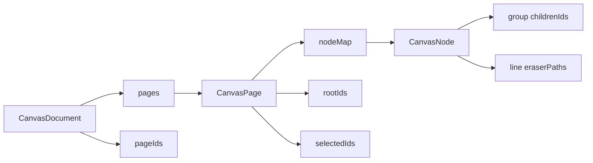

# Paint Canvas

`paint-canvas` 是一个基于 React、TypeScript、Vite、Ant Design 和 LeaferJS 的画布制作工具。当前重点是制作页：用固定 1920 x 1080 业务坐标管理多页面画布，通过 Leafer 渲染和编辑节点，并用 React store 维护可撤销的文档状态。

## 当前能力

- 多页面画布：底部缩略图展示页面，支持新增页面和切换页面。
- 固定业务坐标系：画布数据按 1920 x 1080 存储，DOM 容器变化时只等比缩放和居中。
- 节点编辑：支持选择、框选、多选、拖拽、缩放、旋转和文本双击编辑。
- 基础图形：支持矩形、圆形、椭圆、圆环、扇形、扇形圆环、圆角弧线、线条、三角形、正多边形、星形和文本。
- 自由绘制：顶部工具栏支持选择、画笔、橡皮擦；画笔和橡皮擦都支持粗细选择。
- 局部擦除：普通图形按节点删除，自由线条通过 Leafer eraser 子节点记录局部擦除轨迹。
- 右键菜单：支持打组、拆组、调整层级和删除选中元素。
- 属性面板：支持位置、尺寸、旋转基准、填充、描边颜色、描边粗细、线型、图形专属参数和元素动画配置。
- 缩略图渲染：通过 worker 和 `OffscreenCanvas` 绘制页面缩略图，只展示白色画板和画布内元素。
- 撤销重做：基于 `mutative` patches 记录画布操作历史。
- 图片缓存实验：包含图片请求缓存和 Service Worker 相关实验代码。

## 技术栈

- React 19
- TypeScript 6
- Vite 8
- Ant Design 6
- LeaferJS 2
- Zustand 5
- Mutative
- Oxlint / Oxfmt
- Vitest / Playwright

## 本地运行

```bash
pnpm install
pnpm dev
```

常用命令：

```bash
pnpm build                  # TypeScript 构建 + Vite 生产构建
pnpm lint                   # oxlint
pnpm test                   # Vitest watch 模式
pnpm test:run               # Vitest 单次运行
pnpm e2e                    # Playwright e2e
pnpm image-cache:test-server # 图片缓存实验服务
```

## 目录结构

```text
src/
  pages/
    home/
      components/
        CanvasContextMenu/       画布右键菜单
        CanvasToolbar/           顶部工具栏
        MaterialPanel/           左侧素材面板
        PageThumbnailStrip/      底部缩略图列表
        PropertyPanel/           右侧属性面板
          nodeProperty/          各类节点的专属属性配置
      hooks/
        README.md                Home hooks 拆分说明
        useLeaferCanvas.ts       Leafer 画布 hook 统一入口
        leaferCanvas/
          core/                  LeaferApp 生命周期、stage / board 容器
          geometry/              命中检测和坐标计算
          selection/             store.selectedIds 与 Leafer Editor 同步
          shared/                共享类型
          tools/                 画笔、橡皮擦和指针手势
          tree/                  节点树增量同步和工具模式切换
          ui/                    节点 UI 创建、样式映射和反向 patch
      index.tsx                  制作页入口
      index.less                 制作页样式
  stores/
    canvasStore.ts               多页面画布状态、历史、节点操作
  types/
    canvas/                      画布、页面、store 类型
    edit/                        编辑器类型
    elementNode/                 节点类型
  worker/
    registerImageCacheServiceWorker.ts
    thumbnail/                   缩略图 worker 渲染
tests/
  e2e/                           Playwright 用例
public/
  image-cache-sw.js              图片缓存 Service Worker 实验
scripts/
  image-cache-test-server.mjs    图片缓存测试服务
docs/
  useLeaferCanvas-logic.md       画布 hook 逻辑说明文档
```

## 画布架构

`Home` 页面仍只调用 `useLeaferCanvas`，具体功能已经拆到 `src/pages/home/hooks/leaferCanvas/` 下。详细模块说明见 `src/pages/home/hooks/README.md`。



核心约定：

- `canvasStore` 是唯一真实数据源，Leafer UI 只是按 `nodeId` 维护的渲染缓存。
- `stage` 负责缩放和居中，`board` 是固定 1920 x 1080 白色业务画板。
- 节点同步走增量更新，不调用 `app.tree.clear()`，避免破坏 Leafer Editor 内部选择层。
- 用户选择由 Leafer Editor 写回 store，程序化 `editor.select()` 会用同步标记屏蔽回写。
- 窗口尺寸变化后会刷新当前 Editor 选区，保证多选框宽高跟随新的 stage 缩放。

## 数据结构



- `CanvasDocument` 保存页面字典、页面顺序和当前页面 ID。
- `CanvasPage` 保存固定 viewport、节点字典、根节点顺序和当前选区。
- `CanvasNode` 是可序列化业务节点；组节点用 `childrenIds` 表示层级，自由线条用 `points` 和 `eraserPaths` 表示笔迹与擦除。
- 历史记录保存 `mutative` 正向 / 反向 patches，而不是完整画布快照。

## 开发约定

- 新增节点类型时，同步检查 `types/elementNode`、`leaferCanvas/ui`、属性面板和 `worker/thumbnail`。
- 新增命中规则时，优先放到 `leaferCanvas/geometry/hitDetection.ts`。
- 新增工具模式时，优先在 `leaferCanvas/tools/` 拆独立逻辑，再由 `usePointerTools` 组合。
- 修改 Leafer App 生命周期或原生事件时，优先改 `leaferCanvas/core/useLeaferApp.ts`。
- 修改画布 hook 结构后，同步更新 `src/pages/home/hooks/README.md` 和本文件。

## 后续计划

来自 `.agents/todo.md` 的制作页规划：

- 元素隐藏与展示
- 图片与图片资源三级缓存
- 蒙层、遮罩、阴影、内外阴影、渐变
- 滤镜
- 放大镜
- 路径动画
- 页面过渡动画
- 自定义动画与关键帧动画
- 视频、音频、截图
- 本地模型与 RAG 知识库
- AI 对话
- AI 绘制
- PSD 文件解析
- 导入与导出

预览页规划：

- 展示制作页的所有能力
- 支持画笔操作
- 支持手势控制
