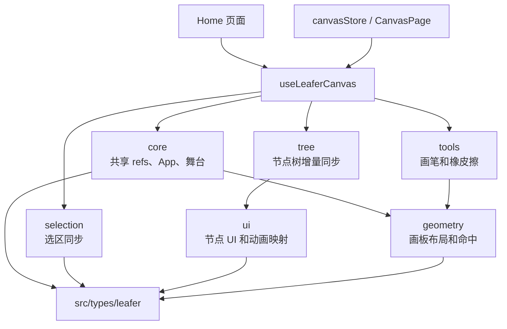
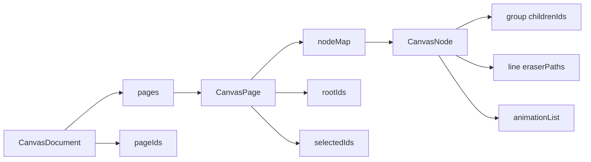

# Paint Canvas

`paint-canvas` 是一个基于 React、TypeScript、Vite、Ant Design 和 LeaferJS 的画布制作工具。当前重点是制作页：用固定 1920 x 1080 业务坐标管理多页面画布，通过 Leafer 渲染和编辑节点，并用 React store 维护可撤销的文档状态。

## 当前能力

- 多页面画布：底部缩略图展示页面，支持新增页面和切换页面。
- 固定业务坐标系：画布数据按 1920 x 1080 存储，DOM 容器变化时只等比缩放和居中。
- 节点编辑：支持选择、框选、多选、拖拽、缩放、旋转和文本双击编辑。
- 基础图形：支持矩形、圆形、椭圆、圆环、扇形、扇形圆环、圆角弧线、线条、三角形、正多边形、星形、文本和远程 URL 图片。
- 图片节点：素材面板只写入测试图 URL；主画布和缩略图通过图片缓存线程取 Blob 再绘制。
- 自由绘制：顶部工具栏支持选择、画笔、橡皮擦；画笔和橡皮擦都支持粗细选择。
- 局部擦除：橡皮擦只擦 `line` 笔迹，通过 Leafer eraser 子节点记录局部擦除轨迹；矩形、椭圆、文本等图形不会被整节点删掉。
- 元素动画：属性面板可配置淡入、淡出、右移、旋转；淡入/淡出支持方向，右移支持起止偏移。多条动画按「淡入 → 移动/旋转 → 淡出」排序，可拖动手柄调整同阶段顺序，并按列表依次播放。
- 右键菜单：支持打组、拆组、调整层级和删除选中元素。
- 属性面板：支持位置、尺寸、旋转基准、填充、描边颜色、描边粗细、线型、图形专属参数和元素动画配置。
- 缩略图渲染：通过 worker 和 `OffscreenCanvas` 绘制页面缩略图，只展示白色画板和画布内元素。
- 图片资源缓存：独立 Dedicated Worker 做内存 LRU → IndexedDB → 网络三级缓存；主画布和缩略图 worker 都通过 MessagePort 向它取 `Blob`，不各自 `fetch`。
- 撤销重做：基于 `mutative` patches 记录画布操作历史。

图片缓存 Service Worker 和测试页代码仍保留在仓库里，但应用启动时不会注册 Service Worker，制作页走 `src/worker/image-cache/` 这套线程缓存。详细设计见 `src/worker/image-cache/README.md`。

## 技术栈

- React 19
- TypeScript 6
- Vite 8
- Ant Design 6
- LeaferJS 2（含 `@leafer-in/editor`、`@leafer-in/text-editor`、`@leafer-in/animate`）
- Zustand 5
- Mutative
- Oxlint / Oxfmt
- Vitest / Playwright

## 本地运行

```bash
pnpm install
pnpm dev
```

常用命令：

```bash
pnpm build      # TypeScript 构建 + Vite 生产构建
pnpm lint       # oxlint
pnpm format     # oxfmt 格式化 src
pnpm test       # Vitest watch 模式
pnpm test:run   # Vitest 单次运行
pnpm e2e        # Playwright e2e
pnpm preview    # 预览生产构建
```

`pnpm install` 会通过 `prepare` 安装 Husky。提交信息须符合 Conventional Commits（`feat:` / `fix:` 等）；`git push` 前会先 `pnpm format` 再跑 `pnpm test:run`。

## 目录结构

```text
src/
  layouts/
    AppLayout/                   应用布局和路由出口
  pages/
    home/
      components/
        CanvasContextMenu/       画布右键菜单
        CanvasToolbar/           顶部工具栏
        MaterialPanel/           左侧素材面板
        PageThumbnailStrip/      底部缩略图列表
        PropertyPanel/           右侧属性面板
          animationOrder.ts      动画阶段顺序和拖拽约束
          nodeProperty/          各类节点的专属属性配置
      hooks/
        README.md                Home hooks 拆分说明
        useLeaferCanvas.ts       Leafer 画布 hook 统一入口
        leaferCanvas/
          core/                  共享 refs、LeaferApp 生命周期、stage / board
            useRuntime.ts        子模块共享的 app / stage / uiMap / callback refs
            useLeaferApp.ts      创建销毁 App，绑 Editor 选择 / 拖拽 / 文本事件
            useStageBoard.ts     等比缩放居中的 stage 与白色 board
          geometry/              纯坐标算法，不依赖 React
            boardLayout.ts       stage 与指针共用的缩放、居中、client→画板换算
            hitDetection.ts      橡皮擦命中 line
          selection/
            useEditorSelection.ts  store.selectedIds → editor.select / cancel
          tools/                 画笔、橡皮擦指针手势
            usePointerTools.ts   绑 DOM pointer；select 交给 Editor
            brush.ts             采样点归一成 LineNode
            eraser.ts            line 局部擦除预览与提交数据
            additiveSelect.ts    Ctrl / Meta / Shift 追加选择
          tree/                  节点树增量同步和工具模式切换
            useNodeTreeSync.ts   board 就绪后触发同步
            syncNodeTree.ts      按 nodeId 增删改 / 排序 UI
            useToolInteractivity.ts  select 可编辑，brush / eraser 关闭拖拽
          ui/                    节点 UI、样式、线条 eraser、动画、uiMap 反查
      index.tsx                  制作页入口
      index.less                 制作页样式
    image-cache-test/            图片缓存实验页（不参与制作页主流程）
  constants/
    materialImages.ts            素材测试图 URL
  router/
    index.tsx                    路由：制作页和图片缓存实验页
  stores/
    canvasStore.ts               多页面画布状态、历史、节点操作
  types/
    canvas/                      画布、页面、store 类型
    edit/                        编辑器类型
    elementNode/                 节点和动画配置类型
    leafer/                      Leafer 运行时、hook 选项和 UI 实例类型
  worker/
    README.md
    image-cache/                 图片 Dedicated Worker：协议、客户端、cache/ 三级缓存
    page-thumbnail/              页面缩略图绘制；images 向图片线程要 Blob
    registerImageCacheServiceWorker.ts

tests/
  e2e/                           Playwright 用例
public/
  image-cache-sw.js              图片缓存 Service Worker 实验（默认不注册）
scripts/
  image-cache-test-server.mjs    图片缓存测试服务
docs/
  useLeaferCanvas-logic.md       画布 hook 逻辑说明文档
```

## 画布架构

`Home` 页面仍只调用 `useLeaferCanvas`，具体功能已经拆到 `src/pages/home/hooks/leaferCanvas/` 下。详细模块说明见 `src/pages/home/hooks/README.md`。


```mermaid
flowchart TD
  Home[Home 页面] --> Entry[useLeaferCanvas]
  Store[canvasStore / CanvasPage] --> Entry

  Entry --> Core[core<br/>共享 refs、App、舞台]
  Entry --> Tree[tree<br/>节点树增量同步]
  Entry --> Tools[tools<br/>画笔和橡皮擦]
  Entry --> Selection[selection<br/>选区同步]

  Core --> Geometry[geometry<br/>画板布局和命中]
  Tools --> Geometry
  Tree --> UI[ui<br/>节点 UI 和动画映射]
  Core --> Types[src/types/leafer]
  Selection --> Types
  UI --> Types
  Geometry --> Types
```

核心约定：

- `canvasStore` 是唯一真实数据源，Leafer UI 只是按 `nodeId` 维护的渲染缓存。
- `stage` 负责缩放和居中，`board` 是固定 1920 x 1080 白色业务画板；舞台缩放和画笔/橡皮指针反算共用 `geometry/boardLayout.ts`。
- 节点同步走增量更新，不调用 `app.tree.clear()`，避免破坏 Leafer Editor 内部选择层。
- 用户选择由 Leafer Editor 写回 store，程序化 `editor.select()` 会用同步标记屏蔽回写。
- 窗口尺寸变化后会刷新当前 Editor 选区，保证多选框宽高跟随新的 stage 缩放。
- 元素动画通过 `@leafer-in/animate` 写到 Leafer `animation`；创建节点时带上动画，之后增量 `set` 不会每次重写，避免拖拽打断播放。
- Leafer 相关运行时类型放在 `src/types/leafer`，不再放在 hook 目录下的 `shared`。
- 画布 hook 内部拆分见 `src/pages/home/hooks/README.md`；逻辑说明见 `docs/useLeaferCanvas-logic.md`。

## 数据结构


```mermaid
flowchart LR
  Document[CanvasDocument] --> Pages[pages]
  Document --> PageIds[pageIds]
  Pages --> Page[CanvasPage]
  Page --> NodeMap[nodeMap]
  Page --> RootIds[rootIds]
  Page --> Selected[selectedIds]
  NodeMap --> Node[CanvasNode]
  Node --> Group[group childrenIds]
  Node --> Line[line eraserPaths]
  Node --> Animation[animationList]
```

- `CanvasDocument` 保存页面字典、页面顺序和当前页面 ID。
- `CanvasPage` 保存固定 viewport、节点字典、根节点顺序和当前选区。
- `CanvasNode` 是可序列化业务节点；组节点用 `childrenIds` 表示层级，自由线条用 `points` 和 `eraserPaths` 表示笔迹与擦除。
- `animationList` 保存节点上的动画配置；渲染时映射为 Leafer `animation`，多条按列表顺序依次播放。
- 历史记录保存 `mutative` 正向 / 反向 patches，而不是完整画布快照。

## 开发约定

- 新增节点类型时，同步检查 `types/elementNode`、`leaferCanvas/ui`、属性面板和 `worker/page-thumbnail`。
- 图片 URL 只通过 `src/worker/image-cache` 加载，不要在主线程或缩略图 worker 里自行 `fetch`。
- 新增命中规则时，优先放到 `leaferCanvas/geometry/hitDetection.ts`。
- 改舞台缩放或指针坐标换算时，只改 `leaferCanvas/geometry/boardLayout.ts`，不要在 `useStageBoard` 和 `usePointerTools` 里各写一套公式。
- 新增工具模式时，优先在 `leaferCanvas/tools/` 拆独立逻辑（如 `brush.ts` / `eraser.ts`），再由 `usePointerTools` 组合。
- 共享 refs 放在 `leaferCanvas/core/useRuntime.ts`；修改 Leafer App 生命周期或原生事件时，优先改 `leaferCanvas/core/useLeaferApp.ts`。
- 节点树增删改细节在 `leaferCanvas/tree/syncNodeTree.ts`，hook 只负责在 board 就绪后触发。
- Leafer hook / UI 运行时类型放到 `src/types/leafer`，不要在 `leaferCanvas` 下再加 `shared` 类型目录。
- 修改画布 hook 结构后，同步更新 `src/pages/home/hooks/README.md`、`docs/useLeaferCanvas-logic.md` 和本文件。
- `@leafer-ui/interface` 和 `@leafer/interface` 通过 pnpm overrides 钉在 `2.2.3`，避免和 `leafer-ui` 出现两套 `IUI` 类型。

## 后续计划

来自 `.agents/todo.md` 的制作页规划：

- 元素隐藏与展示
- 图片节点接入属性面板蒙层等后续能力
- 蒙层、遮罩、阴影、内外阴影、渐变
- 滤镜
- 放大镜
- 路径动画
- 页面过渡动画
- 更完整的自定义关键帧动画
- 视频、音频、截图
- 本地模型与 RAG 知识库
- AI 对话
- AI 绘制
- PSD 文件解析
- 导入与导出

预览页规划：

- 展示制作页的所有能力
- 支持画笔操作
- 支持手势控制
