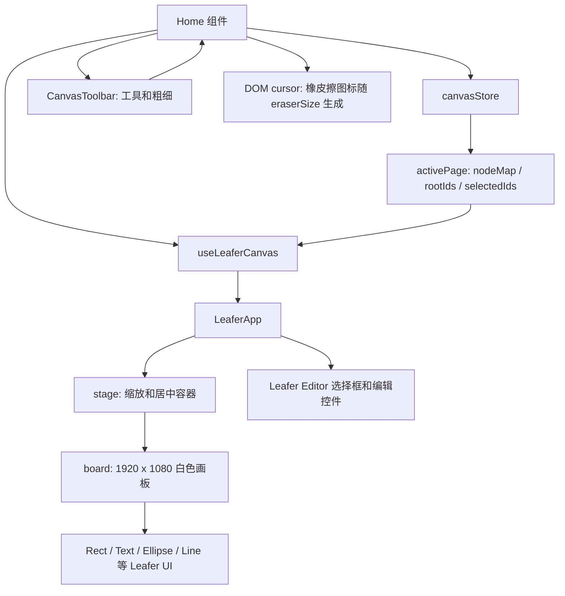
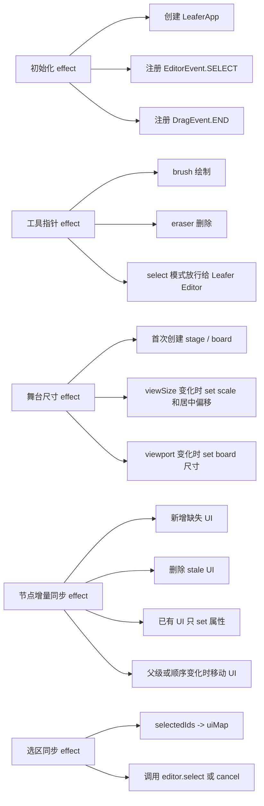
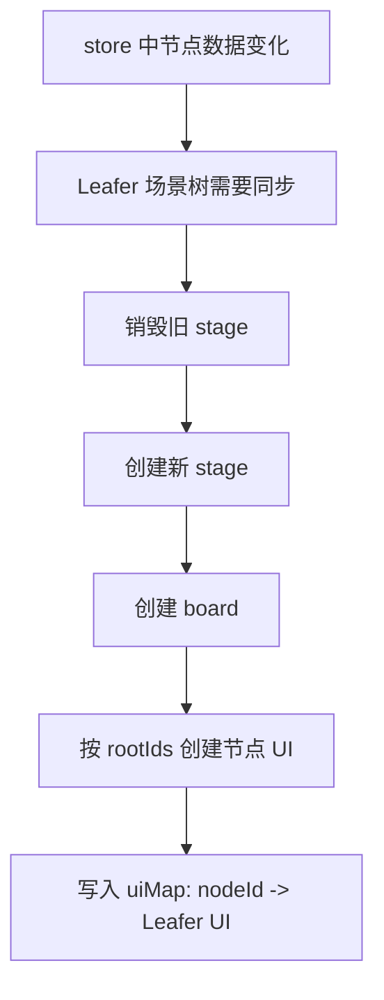
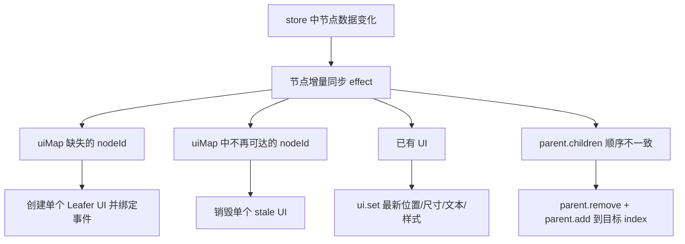
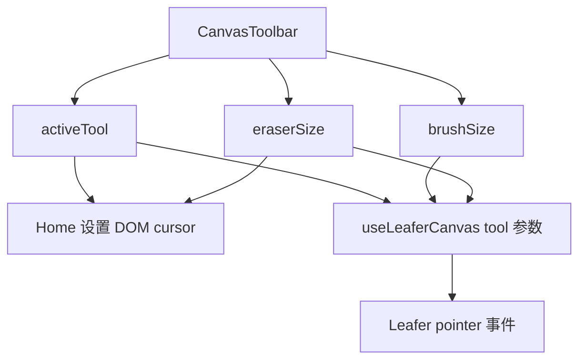
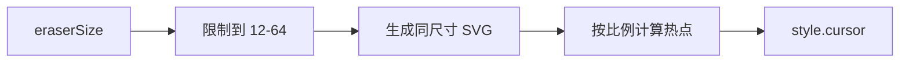
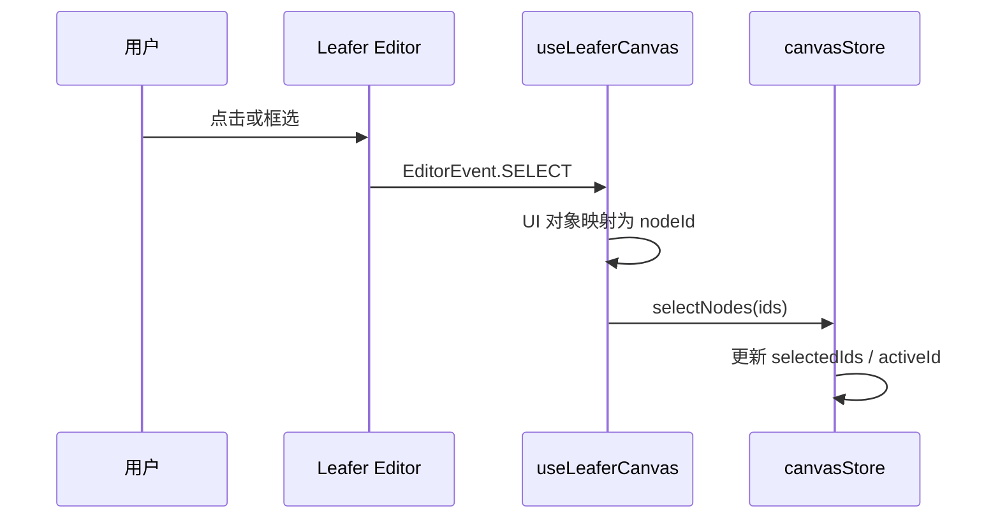
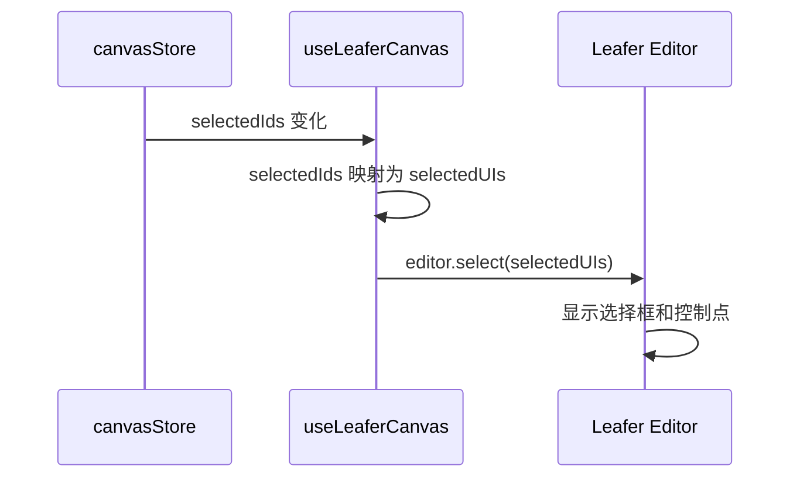
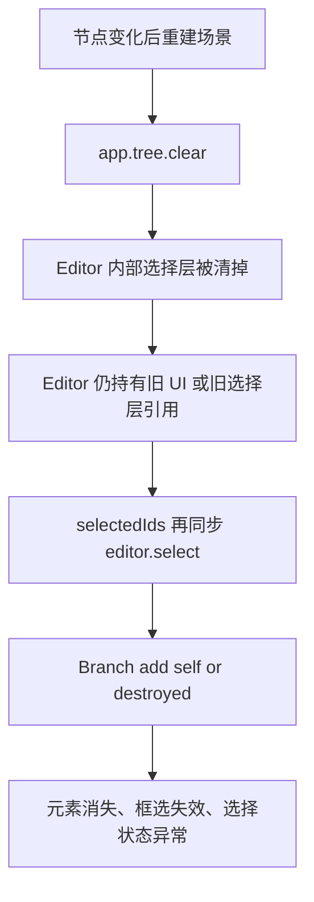
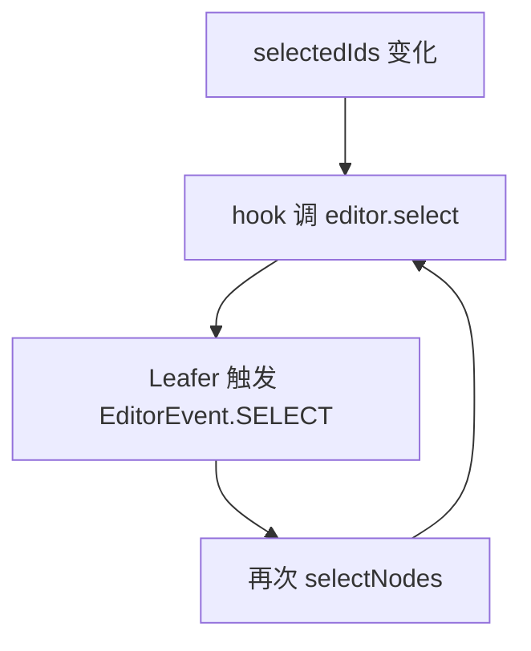

# useLeaferCanvas 逻辑说明

`useLeaferCanvas` 是 React 状态和 Leafer 命令式画布之间的适配层。

React 这边的真实数据源是 `CanvasPage`，也就是 `nodeMap`、`rootIds`、`selectedIds`、`viewport`。Leafer 这边不是 React DOM，不能靠 JSX 自动 diff，所以 hook 需要把 store 里的数据主动同步到 Leafer 实例。

## 总体结构



这里有两个层次：

- `stage / board / UI` 是我们自己渲染的画布内容。
- `Editor` 是 Leafer 插件自己的选择框、控制点、框选区域等内部层。
- `cursor` 是普通 DOM 样式，挂在 `.canvas-maker__canvas` 上，不进入 Leafer 场景树。

这两个层次不能混在一起清理。我们只维护自己的 `stage / board / UI`，不能把整个 `app.tree` 清空。

## Hook 里的几类 effect



## 为什么之前会重建画布

旧实现里的“重建画布”不是重建 React 页面，而是：当画布内容数据变化时，把 Leafer 里的旧 `stage` 销毁，然后用最新 `nodeMap/rootIds` 重新创建 Leafer UI。

重建的原因是 Leafer 是命令式场景树：



这个做法简单，但代价较大。拖拽一个节点、编辑一段文字、切换图层顺序，都会把整个 `stage -> board -> nodes` 重建一遍。后续如果加入图片、视频、音频，这种全量重建会导致媒体实例重新加载或播放状态丢失。

## 当前的增量同步

当前实现已经改成增量同步：



现在各类变化的处理方式是：

- 新增节点：只创建新增节点对应的 UI。
- 删除节点：只销毁被删除节点对应的 UI。
- 拖拽或编辑后的位置、尺寸、文本变化：只对已有 UI 调 `set()`。
- `rootIds` 或 `childrenIds` 顺序变化：只移动对应父容器里的 UI 顺序。
- group 父级变化：只把 UI 从旧父容器移动到新父容器。
- `viewport` 或 `viewSize` 变化：只更新 `stage` 的 `scale/x/y` 和 `board` 的尺寸，不重建节点。

只有一种情况会销毁并重建单个 UI：同一个 nodeId 的 `kind` 发生变化。比如未来把一个节点从 `rect` 变成 `image`，对应 Leafer 类不同，就需要替换这个节点自己的 UI。

不触发节点同步的情况：

- 单纯选中或取消选中，只同步 Editor 选择框。
- 工具从 `select` 切到 `brush` 或 `eraser`，只影响交互模式。

选中态走单独的选区同步 effect。

## 工具光标逻辑

工具模式分两层处理：



`activeTool / brushSize / eraserSize` 都保存在 `Home` 组件里：

- `activeTool` 决定当前是选择、画笔还是橡皮擦。
- `brushSize` 传给 `useLeaferCanvas`，用于创建画笔线条的 `strokeWidth`。
- `eraserSize` 同时传给 `useLeaferCanvas` 和 DOM cursor。前者决定真实擦除路径的宽度，后者决定鼠标图标的视觉大小。

橡皮擦 cursor 不是一个固定尺寸的图片文件，而是在 `Home` 里用 `createEraserCursor(eraserSize)` 动态生成 SVG data URI：



这样做的原因是：如果直接使用用户给的 `width=200 height=200` SVG，浏览器会把鼠标图标渲染得很大，和真实橡皮擦粗细不一致。现在 cursor 的视觉大小跟随工具栏里的橡皮擦粗细，例如：

- 选择 `24px` 时，cursor SVG 是 `24 x 24`。
- 选择 `64px` 时，cursor SVG 是 `64 x 64`。
- 热点也按比例放在橡皮擦左下角附近，避免鼠标实际擦除点和图标位置明显错位。

这部分只影响鼠标显示，不参与节点同步，也不会导致 Leafer UI 重建。

## 选中逻辑

选中有两个方向的数据流。

### 用户操作到 store



Leafer 的 `EditorEvent.SELECT` 给的是 UI 对象，不是业务 id。hook 用 `uiMapRef` 反查：

```text
Leafer UI -> nodeId -> selectNodes(ids)
```

### store 到 Leafer Editor



这一段只是同步选择框，不应该改节点数据，也不应该重建场景。

## 之前为什么会出问题

之前场景重建时用了：

```ts
app.tree.clear();
```

问题是 `app.tree` 里不只有我们的节点，也可能有 Leafer Editor 自己的选择层、编辑框、控制点等内部对象。

错误链路大致是：



所以修复后不再清空整个 `app.tree`。第一次创建时把 `stage` 加进去，之后只维护自己的 `stageRef` 和 `boardRef`：

```mermaid
flowchart TD
  First[首次初始化] --> Create[创建 stage / board]
  Create --> Add[app.tree.add(stage)]
  Resize[viewSize / viewport 变化] --> StageSet[stage.set scale/x/y]
  Resize --> BoardSet[board.set width/height]
  Editor[Leafer Editor 内部层] --> Keep[保留不动]
```

这能避免破坏 Leafer Editor 的内部结构。

## 当前同步保护

还有一个细节：代码主动调用 `editor.select()` 时，Leafer 也可能同步触发 `EditorEvent.SELECT`。

如果不保护，就会形成回环：



所以现在用 `isSyncingEditorSelectionRef` 标记“这是程序同步，不是用户操作”。这类事件会被忽略，只处理用户真实点击或框选触发的选择事件。

同时，调用 `editor.select()` 前会比较当前 Editor 选区和目标选区是否一致。一致就不重复调用，减少 Leafer 内部状态抖动。

## 一句话总结

`useLeaferCanvas` 的原则是：

- `stage/board` 初始化一次，尺寸变化只更新缩放和尺寸。
- `nodeMap/rootIds` 变化时，对节点 UI 做增量增删改和排序。
- `selectedIds` 变化时，只同步 Leafer Editor 的选择框。
- 不清空整个 `app.tree`，避免破坏 Leafer Editor 内部层。
- 程序化 `editor.select()` 触发的选择事件不再反写 store，避免循环。
