# useLeaferCanvas 逻辑说明

`useLeaferCanvas` 是 React 状态和 Leafer 命令式画布之间的适配层。

React 这边的真实数据源是 `CanvasPage`，也就是 `nodeMap`、`rootIds`、`selectedIds`、`viewport`。Leafer 这边不是 React DOM，不能靠 JSX 自动 diff，所以 hook 需要把 store 里的数据主动同步到 Leafer 实例。

## 总体结构

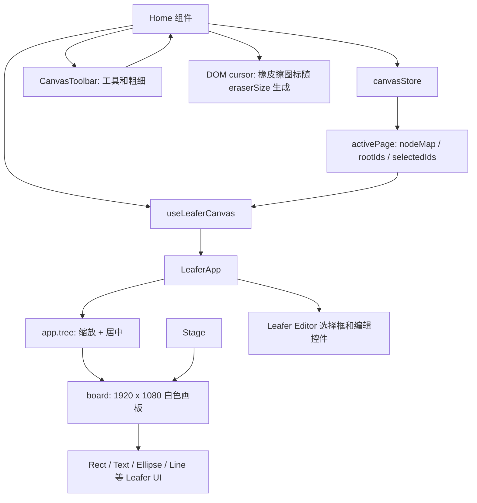
```mermaid
flowchart TD
  Home[Home 组件] --> Store[canvasStore]
  Home --> Toolbar[CanvasToolbar: 工具和粗细]
  Toolbar --> Home
  Home --> Cursor[DOM cursor: 橡皮擦图标随 eraserSize 生成]
  Home --> Hook[useLeaferCanvas]
  Store --> Page[activePage: nodeMap / rootIds / selectedIds]
  Page --> Hook
  Hook --> App[LeaferApp]
  App --> Tree["app.tree: 缩放 + 居中"]
  Tree --> Board[board: 1920 x 1080 白色画板]
  Stage --> Board[board: 1920 x 1080 白色画板]
  Board --> UI[Rect / Text / Ellipse / Line 等 Leafer UI]
  App --> Editor[Leafer Editor 选择框和编辑控件]
```

这里有两个层次：

- `board / UI` 是我们自己渲染的画布内容，`app.tree` 上的缩放和居中偏移也是我们设的。
- `Editor` 是 Leafer 插件自己的选择框、控制点、框选区域等内部层。
- `cursor` 是普通 DOM 样式，挂在 `.canvas-maker__canvas` 上，不进入 Leafer 场景树。

这两个层次不能混在一起清理。我们只维护自己的 `board / UI`，不能把整个 `app.tree` 清空。

## 代码拆分

`useLeaferCanvas` 只组装子模块。落点如下：

| 职责 | 文件 |
|---|---|
| 共享 refs | `core/useRuntime.ts` |
| 创建销毁 App、Editor 原生事件 | `core/useLeaferApp.ts` |
| 画布缩放居中（挂在 app.tree） | `core/useStageBoard.ts` |
| 标尺 | `core/useRuler.ts`（`leafer-x-ruler`） |
| 对齐参考线和吸附 | `core/useSnap.ts`（`leafer-x-easy-snap`） |
| 舞台与指针共用的坐标公式 | `geometry/boardLayout.ts` |
| 画笔 / 橡皮擦 | 插件 `packages/leafer-x-brush-eraser`，接线在 `core/useBrushTool` / `useEraserTool` |
| 节点增量同步 | `tree/useNodeTreeSync.ts` → `tree/syncNodeTree.ts` |
| 放大镜 | 插件 `leafer-x-magnifier`，接线在 `core/useMagnifier.ts` |
| 追加选择修饰键 | `tools/additiveSelect.ts` |
| store.selectedIds → Editor | `selection/useEditorSelection.ts` |
| UI 反查 nodeId | `ui/uiMap.ts` |

详细目录说明见 `src/pages/home/hooks/README.md`。

## Hook 里的几类 effect

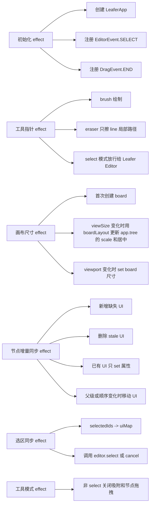
```mermaid
flowchart LR
  A[初始化 effect] --> A1[创建 LeaferApp]
  A --> A2[注册 EditorEvent.SELECT]
  A --> A3[注册 DragEvent.END]

  B[工具指针 effect] --> B1[brush 绘制]
  B --> B2[eraser 只擦 line 局部路径]
  B --> B3[select 模式放行给 Leafer Editor]

  C[画布尺寸 effect] --> C1[首次创建 board]
  C --> C2[viewSize 变化时用 boardLayout 更新 app.tree 的 scale 和居中]
  C --> C3[viewport 变化时 set board 尺寸]

  D[节点增量同步 effect] --> D1[新增缺失 UI]
  D --> D2[删除 stale UI]
  D --> D3[已有 UI 只 set 属性]
  D --> D4[父级或顺序变化时移动 UI]

  E[选区同步 effect] --> E1[selectedIds -> uiMap]
  E --> E2[调用 editor.select 或 cancel]

  F[工具模式 effect] --> F1[非 select 关闭吸附和节点拖拽]
```

## 为什么之前会重建画布

旧实现里的“重建画布”不是重建 React 页面，而是：当画布内容数据变化时，把 Leafer 里的旧 `stage` 销毁，然后用最新 `nodeMap/rootIds` 重新创建 Leafer UI。

重建的原因是 Leafer 是命令式场景树：

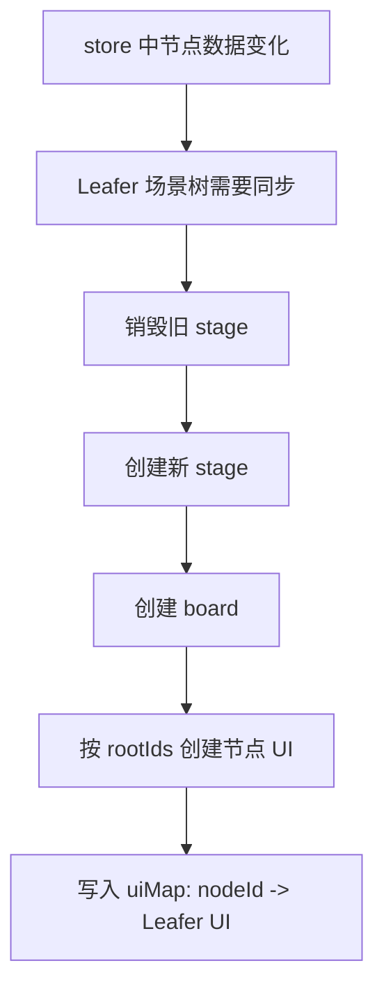
```mermaid
flowchart TD
  StoreChange[store 中节点数据变化] --> NeedSync[Leafer 场景树需要同步]
  NeedSync --> DestroyOld[销毁旧 stage]
  DestroyOld --> CreateStage[创建新 stage]
  CreateStage --> CreateBoard[创建 board]
  CreateBoard --> CreateNodes[按 rootIds 创建节点 UI]
  CreateNodes --> Map[写入 uiMap: nodeId -> Leafer UI]
```

这个做法简单，但代价较大。拖拽一个节点、编辑一段文字、切换图层顺序，都会把整个 `stage -> board -> nodes` 重建一遍。后续如果加入图片、视频、音频，这种全量重建会导致媒体实例重新加载或播放状态丢失。

## 当前的增量同步

当前实现已经改成增量同步：

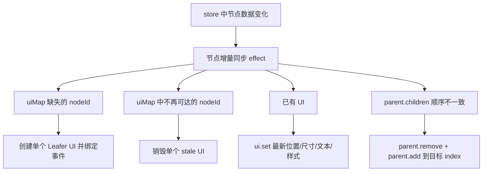
```mermaid
flowchart TD
  StoreChange[store 中节点数据变化] --> Sync[节点增量同步 effect]
  Sync --> Missing[uiMap 缺失的 nodeId]
  Missing --> Create[创建单个 Leafer UI 并绑定事件]
  Sync --> Removed[uiMap 中不再可达的 nodeId]
  Removed --> Destroy[销毁单个 stale UI]
  Sync --> Existing[已有 UI]
  Existing --> Set[ui.set 最新位置/尺寸/文本/样式]
  Sync --> Order[parent.children 顺序不一致]
  Order --> Move[parent.remove + parent.add 到目标 index]
```

现在各类变化的处理方式是：

- 新增节点：只创建新增节点对应的 UI。
- 删除节点：只销毁被删除节点对应的 UI。
- 拖拽或编辑后的位置、尺寸、文本变化：只对已有 UI 调 `set()`。
- `rootIds` 或 `childrenIds` 顺序变化：只移动对应父容器里的 UI 顺序。
- group 父级变化：只把 UI 从旧父容器移动到新父容器。
- `viewport` 或 `viewSize` 变化：只更新 `app.tree` 的缩放和居中偏移、`board` 的外观，不重建节点。

只有一种情况会销毁并重建单个 UI：同一个 nodeId 的 `kind` 发生变化。比如未来把一个节点从 `rect` 变成 `image`，对应 Leafer 类不同，就需要替换这个节点自己的 UI。

不触发节点同步的情况：

- 单纯选中或取消选中，只同步 Editor 选择框。
- 工具从 `select` 切到 `brush` / `eraser` / `magnifier`，只影响交互模式。

选中态走单独的选区同步 effect。

## 工具光标逻辑

工具模式分两层处理：

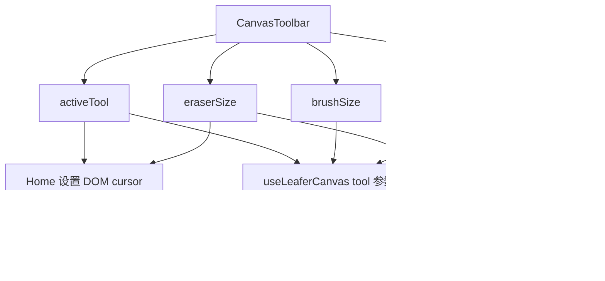
```mermaid
flowchart TD
  Toolbar[CanvasToolbar] --> Mode[activeTool]
  Toolbar --> BrushSize[brushSize]
  Toolbar --> EraserSize[eraserSize]
  Toolbar --> MagnifierOptions[magnifierSize / magnifierZoom]
  Mode --> HomeStyle[Home 设置 DOM cursor]
  EraserSize --> HomeStyle
  Mode --> HookTool[useLeaferCanvas tool 参数]
  BrushSize --> HookTool
  EraserSize --> HookTool
  MagnifierOptions --> HookTool
  HookTool --> Pointer[Leafer pointer 事件]
```

`activeTool / brushSize / eraserSize / magnifierSize / magnifierZoom` 都保存在 `Home` 组件里：

- `activeTool` 决定当前是选择、画笔、橡皮擦还是放大镜。
- `brushSize` 传给 `useLeaferCanvas`，用于创建画笔线条的 `strokeWidth`。
- `eraserSize` 同时传给 `useLeaferCanvas` 和 DOM cursor。前者决定真实擦除路径的宽度，后者决定鼠标图标的视觉大小。
- `magnifierSize` / `magnifierZoom` 只影响镜片：直径是 CSS 像素，倍率是相对当前屏幕显示的放大倍数。

橡皮擦 cursor 不是一个固定尺寸的图片文件，而是在 `Home` 里用 `createEraserCursor(eraserSize)` 动态生成 SVG data URI：

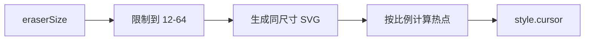
```mermaid
flowchart LR
  EraserSize[eraserSize] --> Clamp[限制到 12-64]
  Clamp --> Svg[生成同尺寸 SVG]
  Svg --> Hotspot[按比例计算热点]
  Hotspot --> CursorStyle[style.cursor]
```

这样做的原因是：如果直接使用用户给的 `width=200 height=200` SVG，浏览器会把鼠标图标渲染得很大，和真实橡皮擦粗细不一致。现在 cursor 的视觉大小跟随工具栏里的橡皮擦粗细，例如：

- 选择 `24px` 时，cursor SVG 是 `24 x 24`。
- 选择 `64px` 时，cursor SVG 是 `64 x 64`。
- 热点也按比例放在橡皮擦左下角附近，避免鼠标实际擦除点和图标位置明显错位。

这部分只影响鼠标显示，不参与节点同步，也不会导致 Leafer UI 重建。

## 放大镜逻辑

放大镜是自研插件 `packages/leafer-x-magnifier`，制作页只负责接线（`core/useMagnifier.ts`）。

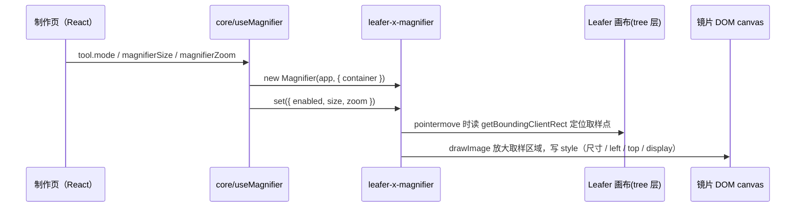
```mermaid
sequenceDiagram
  participant Host as 制作页（React）
  participant Hook as core/useMagnifier
  participant Plugin as leafer-x-magnifier
  participant Source as Leafer 画布(tree 层)
  participant Lens as 镜片 DOM canvas

  Host->>Hook: tool.mode / magnifierSize / magnifierZoom
  Hook->>Plugin: new Magnifier(app, { container })
  Hook->>Plugin: set({ enabled, size, zoom })
  Plugin->>Source: pointermove 时读 getBoundingClientRect 定位取样点
  Plugin->>Lens: drawImage 放大取样区域，写 style（尺寸 / left / top / display）
```

插件与宿主的边界：

- **插件不依赖任何框架，也不持有状态。** 包里没有 React / Vue / store，只提供命令式 API
  （`enabled` / `size` / `zoom` / `set()`）和 DOM 行为；状态留在宿主里，React 用 store、Vue 用
  `reactive`、纯 JS 用普通变量都可以（Vue 适配示例见插件 README）。
- **镜片由插件自己创建。** 宿主只提供定位容器，React 侧不再渲染镜片 `<canvas>`；
  构造插件不碰 DOM，第一次指针悬停才创建，方便在没有 `document` 的阶段先建实例。
- **镜片不进 Leafer 场景树。** 它是普通 DOM canvas，所以不影响节点增量同步。

插件内部实现上沿用了原来验证过的几点：

- **取样来源是渲染结果**：直接对 `app.tree.canvas.view` 做 `drawImage`，笔迹、图片、动画当前帧都会被一起放大，不需要复制场景树；图片走 `object URL`，画布不会被跨域污染，读像素是安全的。
- **必须取 tree 层**：带 `editor` 的 App 是多层 Leafer，`App` 自身的 `canvas` 不是业务内容，`sky` 层是 Editor 控制框。取错层会放大到空白或选择框。
- **倍率相对屏幕**：`sourceLength = size / zoom`，只和镜片直径有关，和画板自身的 `scale` 无关。
- **不夹紧取样区域**：指针永远是镜片和取样区域的共同中心，贴着画板边缘时越界部分交给 `drawImage` 裁掉，再靠白底补齐。
- **镜片必须 `pointer-events: none`**：镜片始终压在指针下面，如果它能命中，会和画布的 `pointermove` / `pointerleave` 互相触发，出现闪烁。
- **不接管手势**：`usePointerTools` 在 `magnifier` 模式下直接返回，既不画线也不擦除；节点可编辑性仍由 `useToolInteractivity` 关掉。

## 标尺

标尺用 `leafer-x-ruler`，接线在 `core/useRuler.ts`，`ruleSize` 取 `boardLayout.BOARD_INSET`，和白板让位的空间是同一个值。

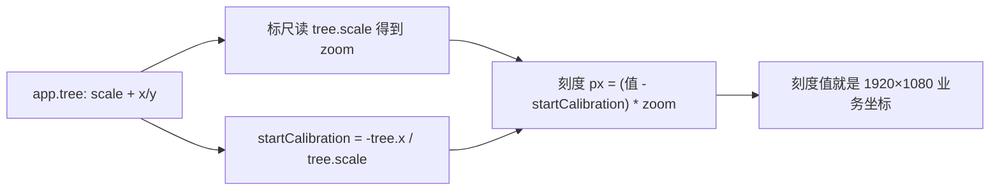
```mermaid
flowchart LR
  Tree["app.tree: scale + x/y"] --> Zoom[标尺读 tree.scale 得到 zoom]
  Tree --> Calib["startCalibration = -tree.x / tree.scale"]
  Zoom --> Tick["刻度 px = (值 - startCalibration) * zoom"]
  Calib --> Tick
  Tick --> Label[刻度值就是 1920×1080 业务坐标]
```

两个接入要点：

- **只能挂在 `app.tree` 的变换上**：插件硬编码读 `app.tree.scale` / `app.tree.worldTransform`，缩放放在更内层它读不到。
- **标尺层要关掉指针命中**：`Ruler` 会往 app 上加一层 Leafer 盖在整个视图上，默认可以命中指针，会挡住 Leafer Editor 的点击和拖拽，所以创建后设置 `rulerLeafer.canvas.hittable = false`。

## 对齐参考线与吸附

吸附用 `leafer-x-easy-snap`，接线在 `core/useSnap.ts`，只在 `select` 模式下开启（只有这个模式能拖节点）。

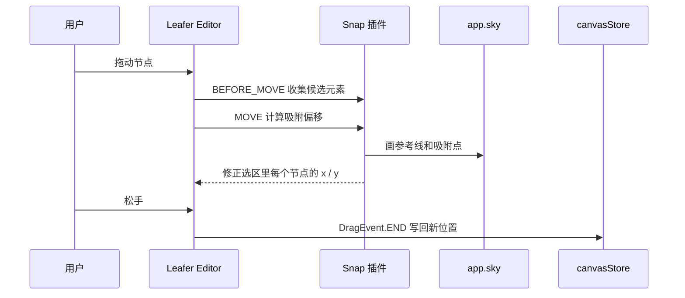
```mermaid
sequenceDiagram
  participant User as 用户
  participant Editor as Leafer Editor
  participant Snap as Snap 插件
  participant Sky as app.sky
  participant Store as canvasStore

  User->>Editor: 拖动节点
  Editor->>Snap: BEFORE_MOVE 收集候选元素
  Editor->>Snap: MOVE 计算吸附偏移
  Snap->>Sky: 画参考线和吸附点
  Snap-->>Editor: 修正选区里每个节点的 x / y
  User->>Editor: 松手
  Editor->>Store: DragEvent.END 写回新位置
```

两个关键约束：

- **`parentContainer` 必须传 `board`。** 插件只收集 `[parentContainer, ...parentContainer.children]`，不递归；传 `app.tree` 的话候选元素只剩 board 自己，兄弟节点之间的吸附全部失效。
- **`snapSize` 要按显示缩放换算。** 插件的包围盒和比较都发生在 `app.tree` 的局部坐标里，缩放挂在 tree 上时这个空间就是画板像素，所以屏幕 5px 的吸附范围要写成 `5 / tree.scale`，否则缩放越小吸附越难触发。

另外两点实现细节：

- 参考线和吸附点由插件画到 `app.sky`，不进 `board.children`，所以不会和 `syncNodeTree` 的 children 顺序维护互相干扰。
- 插件在元素上读 `isSnap` 属性（默认 `true`）决定是否参与吸附；本项目所有节点保持默认，即全部参与。

## 选中逻辑

选中有两个方向的数据流。

### 用户操作到 store

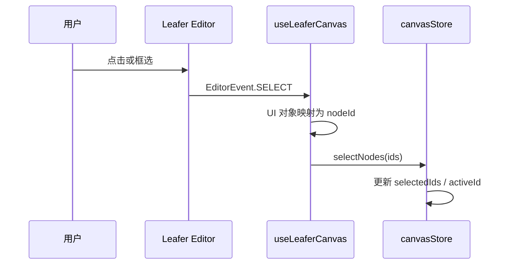
```mermaid
sequenceDiagram
  participant User as 用户
  participant Leafer as Leafer Editor
  participant Hook as useLeaferCanvas
  participant Store as canvasStore

  User->>Leafer: 点击或框选
  Leafer->>Hook: EditorEvent.SELECT
  Hook->>Hook: UI 对象映射为 nodeId
  Hook->>Store: selectNodes(ids)
  Store->>Store: 更新 selectedIds / activeId
```

Leafer 的 `EditorEvent.SELECT` 给的是 UI 对象，不是业务 id。`useLeaferApp` 用 `findNodeIdByUI` 反查：

```text
Leafer UI -> nodeId -> selectNodes(ids)
```

### store 到 Leafer Editor

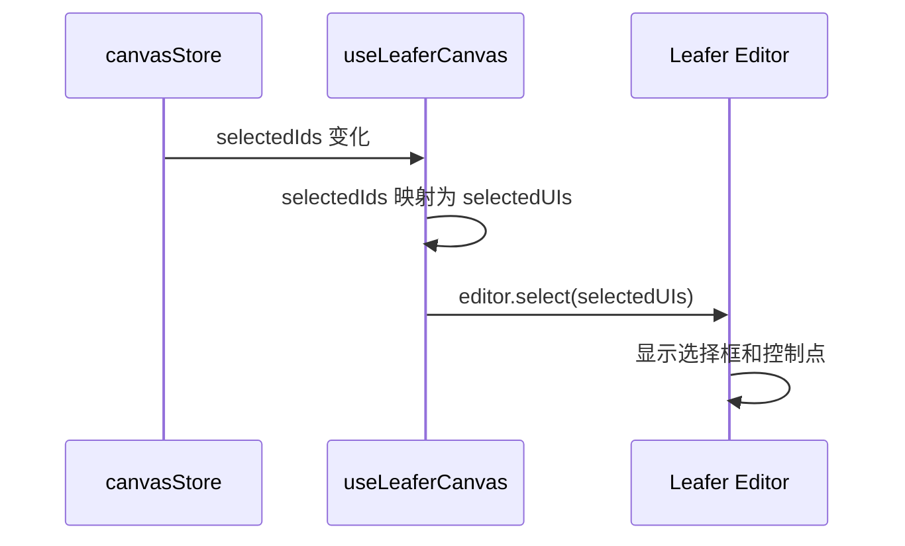
```mermaid
sequenceDiagram
  participant Store as canvasStore
  participant Hook as useLeaferCanvas
  participant Leafer as Leafer Editor

  Store->>Hook: selectedIds 变化
  Hook->>Hook: selectedIds 映射为 selectedUIs
  Hook->>Leafer: editor.select(selectedUIs)
  Leafer->>Leafer: 显示选择框和控制点
```

这一段只是同步选择框，不应该改节点数据，也不应该重建场景。

## 之前为什么会出问题

之前场景重建时用了：

```ts
app.tree.clear();
```

问题是 `app.tree` 里不只有我们的节点，也可能有 Leafer Editor 自己的选择层、编辑框、控制点等内部对象。

错误链路大致是：

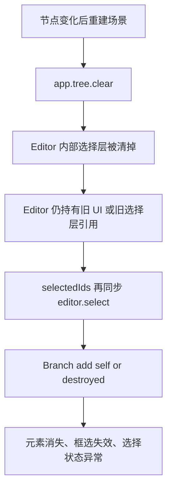
```mermaid
flowchart TD
  Rebuild[节点变化后重建场景] --> ClearTree[app.tree.clear]
  ClearTree --> EditorLost[Editor 内部选择层被清掉]
  EditorLost --> OldRef[Editor 仍持有旧 UI 或旧选择层引用]
  OldRef --> SyncSelect[selectedIds 再同步 editor.select]
  SyncSelect --> Warning[Branch add self or destroyed]
  Warning --> Broken[元素消失、框选失效、选择状态异常]
```

所以修复后不再清空整个 `app.tree`。第一次创建时把 `board` 加进去，之后只维护自己的 `boardRef`：

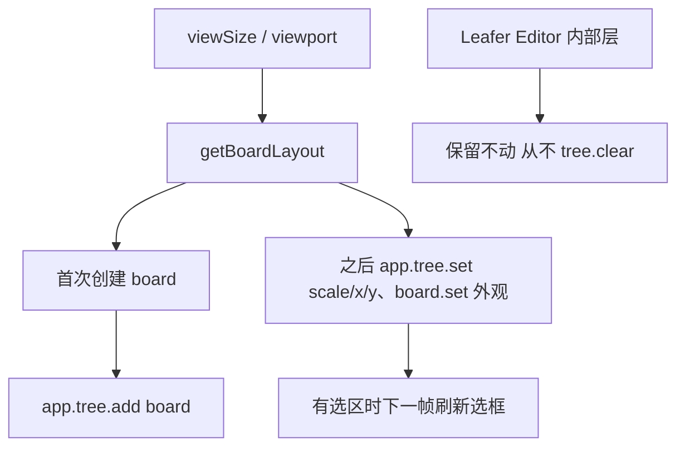
```mermaid
flowchart TD
  Size[viewSize / viewport] --> Layout[getBoardLayout]
  Layout --> First[首次创建 board]
  First --> Add["app.tree.add board"]
  Layout --> Later["之后 app.tree.set scale/x/y、board.set 外观"]
  Later --> Refresh[有选区时下一帧刷新选框]
  Editor[Leafer Editor 内部层] --> Keep[保留不动 从不 tree.clear]
```

`getBoardLayout` 和画笔/橡皮指针反算是同一套公式。变换后刷新选区，是为了让多选框宽高跟上新的坐标变换，不是重建节点。

**缩放和居中挂在 `app.tree` 上，`board` 自身不缩放。** 结构是 `app.tree -> board -> nodes`：

- 标尺（`leafer-x-ruler`）按 `app.tree.scale` 和 `app.tree.worldTransform` 校准刻度，挂在更内层它读不到，刻度就会按屏幕像素而不是 1920×1080 业务坐标标注。
- 吸附（`leafer-x-easy-snap`）用 `getBounds('box', app.tree)` 取包围盒，量出来是 `app.tree` 的局部坐标；缩放挂在 tree 上时这里 1 个单位正好等于 1 个画板像素，所以 `snapSize` 要按显示缩放换算（见 `useSnap`）。
- `board` 的外观（描边、圆角、投影）按屏幕像素给，写进 Leafer 之前除以显示缩放，否则缩放到 0.35 后 1px 描边会变成 0.35px 直接看不见。

**白板要给标尺让位。** `leafer-x-ruler` 把刻度条画在画布视图左上角，所以 `getBoardLayout` 先用 `BOARD_INSET` 扣掉刻度条空间，再在剩余区域里等比缩放居中。指针反算、舞台变换、标尺 `ruleSize` 共用这个常量，鼠标落点才不会和看到的白板错开。

## 当前同步保护

还有一个细节：代码主动调用 `editor.select()` 时，Leafer 也可能同步触发 `EditorEvent.SELECT`。

如果不保护，就会形成回环：

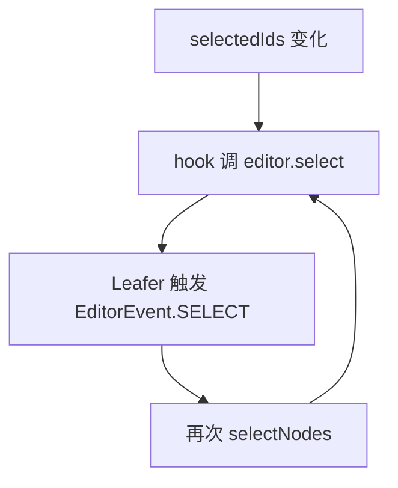
```mermaid
flowchart TD
  StoreSelected[selectedIds 变化] --> HookSelect[hook 调 editor.select]
  HookSelect --> EditorEvent[Leafer 触发 EditorEvent.SELECT]
  EditorEvent --> StoreAgain[再次 selectNodes]
  StoreAgain --> HookSelect
```

所以现在用 `isSyncingEditorSelectionRef` 标记“这是程序同步，不是用户操作”。这类事件会被忽略，只处理用户真实点击或框选触发的选择事件。

同时，调用 `editor.select()` 前会比较当前 Editor 选区和目标选区是否一致。一致就不重复调用，减少 Leafer 内部状态抖动。

## 一句话总结

`useLeaferCanvas` 的原则是：

- `board` 初始化一次；尺寸变化只更新 `app.tree` 的缩放/居中和 board 外观，缩放公式与指针反算共用 `boardLayout`。
- 标尺挂在 `app.tree` 的变换上，白板按 `BOARD_INSET` 让出刻度条空间。
- `nodeMap/rootIds` 变化时，对节点 UI 做增量增删改和排序。
- `selectedIds` 变化时，只同步 Leafer Editor 的选择框。
- `select` 模式下由 `useSnap` 接管拖拽时的对齐参考线和吸附，其它工具关闭。
- 不清空整个 `app.tree`，避免破坏 Leafer Editor 内部层。
- 程序化 `editor.select()` 触发的选择事件不再反写 store，避免循环。
