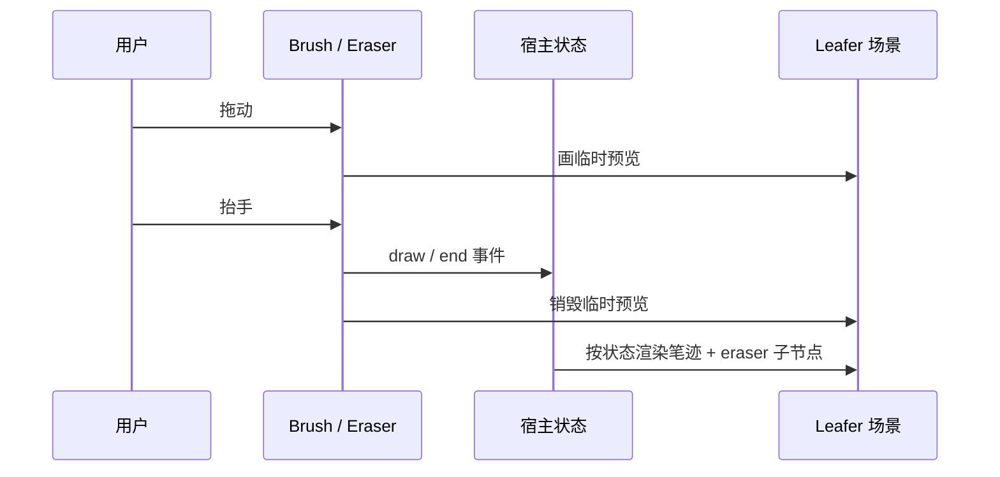

# leafer-x-brush-eraser

Leafer 自由绘制与橡皮擦插件：指针手势采集、实时预览，数据通过事件交回宿主。

插件只做两件事：**接管手势**、**画预览**。笔迹和擦除结果通过事件抛出，
宿主拿去写自己的状态（React store、Vue `reactive`、普通数组都行），插件不持有文档状态。

## 特点

- **不依赖任何框架。** `src/` 里没有 React / Vue / store，宿主状态怎么管与插件无关。
- **不依赖宿主的数据模型。** 坐标用 Leafer 的 `getWorldPointByPage()` 自己换算，
  命中用 Leafer 的选择器，插件不需要知道宿主的画板缩放、居中偏移或节点结构。
- **预览是临时的。** 笔迹预览是一条临时 `Line`，擦除预览是一条 `eraser: "pixel"` 的临时 `Line`，
  都在松手时销毁；持久化完全由宿主决定。
- **拖出画布也能结束。** `pointerup` / `pointercancel` 挂在 window 上，不会留下半截预览。

## 安装

```bash
pnpm add leafer-x-brush-eraser
```

需要宿主自己提供 Leafer（`@leafer-ui/core` 或 `leafer-ui`）。

## 使用：纯 HTML / 无框架

```ts
import { App, Frame, Line } from "leafer-ui";
import { Brush, Eraser } from "leafer-x-brush-eraser";

const app = new App({ view: window, fill: "#eef1f6" });
const board = new Frame({ width: 1920, height: 1080, fill: "#ffffff", overflow: "hide" });

app.tree.add(board);

const brush = new Brush({ container: board, strokeWidth: 8 });

brush.on("draw", (event) => {
  board.add(new Line({ ...event, fill: "transparent", strokeCap: "round", curve: 0.2 }));
});

const eraser = new Eraser({ container: board, strokeWidth: 24 });

eraser.on("erase", ({ container, points, strokeWidth }) => {
  container.add(
    new Line({
      eraser: "pixel",
      points,
      strokeWidth,
      stroke: "#000000",
      strokeCap: "round",
      x: 0,
      y: 0,
    }),
  );
});

// 工具切换就是普通的赋值，状态放哪由宿主决定。
brush.enabled = true;
eraser.enabled = false;
```

## 事件

| 事件    | 触发时机                         | 载荷                                                   |
| ------- | -------------------------------- | ------------------------------------------------------ |
| `draw`  | 一段笔迹结束时                   | `{ x, y, width, height, points, stroke, strokeWidth }` |
| `erase` | 一次手势里每个被擦到的元素各一次 | `{ target, container, offset, points, strokeWidth }`   |

`draw` 的 `x / y / width / height` 是外接矩形（容器局部坐标），`points` 是相对外接矩形左上角的
局部点，按 x/y 成对排列 —— 这样之后拖拽整条笔迹只需要改 `x / y`。

`erase` 的 `points` 相对 `container`（也就是被擦元素的父级），`offset` 是目标包围盒相对
`container` 的偏移，宿主用 `points - offset` 就能换算到自己的节点局部坐标。

## 配置

### Brush

| 配置项        | 说明                                             | 默认值               |
| ------------- | ------------------------------------------------ | -------------------- |
| `container`   | 笔迹落在哪个 Leafer 容器里（决定坐标空间），必填 | -                    |
| `view`        | 监听指针的元素                                   | 容器所在画布的父容器 |
| `enabled`     | 是否启用                                         | `true`               |
| `stroke`      | 描边颜色                                         | `#111827`            |
| `strokeWidth` | 描边宽度（容器局部坐标）                         | `8`                  |
| `minDistance` | 采样节流距离                                     | `2`                  |
| `curve`       | 透传给 Leafer `Line` 的曲线平滑度                | `0.2`                |

### Eraser

| 配置项        | 说明                                      | 默认值               |
| ------------- | ----------------------------------------- | -------------------- |
| `container`   | 擦除发生在哪个 Leafer 容器里，必填        | -                    |
| `view`        | 监听指针的元素                            | 容器所在画布的父容器 |
| `enabled`     | 是否启用                                  | `true`               |
| `strokeWidth` | 擦除宽度（容器局部坐标），同时是命中直径  | `24`                 |
| `minDistance` | 采样节流距离                              | `2`                  |
| `erasable`    | `(target) => boolean`，限定哪些元素能被擦 | 任何命中的元素       |
| `preview`     | 是否实时预览擦除效果                      | `true`               |

## 内置属性与方法

| 成员                              | 说明                                             |
| --------------------------------- | ------------------------------------------------ |
| `enabled`                         | 启用 / 禁用（get / set）；禁用会丢弃预览且不提交 |
| `set(config)`                     | 更新配置（`container` / `view` 只能在构造时给）  |
| `on(type, listener)` / `off(...)` | 订阅 / 取消订阅事件                              |
| `cancel()`                        | 中断当前手势：丢掉预览且不抛事件                 |
| `dispose()`                       | 解绑指针事件、丢弃预览并解除全部监听             |

同时导出可直接单测的纯函数与工具：`normalizeLinePoints`、`getPointDistance`、
`padSinglePoint`、`toContainerPoint`、`getContainerView`、`createPointerGesture`、`Emitter`。

## 在 React / Vue 里用

插件只给命令式 API 和事件，**状态由宿主自己管**。宿主需要负责三件事：

1. **存笔迹**：收到 `draw` 就写进自己的状态。
2. **存擦除轨迹**：收到 `end` 就把轨迹记到对应笔迹上（一次手势只提交一条历史）。
3. **重建场景时复原**：从状态渲染出笔迹节点，并把每条轨迹渲染成一个 `eraser: "pixel"` 子节点 ——
   否则重新加载 / 切页之后擦除效果会消失。

事件里的 `container` 就是「这条笔迹在 Leafer 里的父容器」，宿主用它把自己的数据和 UI 对应起来
（示例用一个 `WeakMap<IUI, 笔迹 id>`）。



### React

```tsx
import { useEffect, useRef } from "react";
import { Group, Line } from "leafer-ui";
import type { Frame, IUI } from "leafer-ui";
import { Brush, Eraser } from "leafer-x-brush-eraser";
import type { BrushDrawEvent } from "leafer-x-brush-eraser";

// 片段：addStroke / appendEraser 是宿主自己的 store 方法，这里不展开。

type Stroke = BrushDrawEvent & { id: string; erasers: { points: number[]; strokeWidth: number }[] };

/** 笔迹 -> Leafer 节点：笔迹本身一条 Line，每条擦除轨迹一个 eraser 子节点。 */
const createStrokeUIs = (stroke: Stroke) => {
  const group = new Group({ x: stroke.x, y: stroke.y });

  group.add(
    new Line({
      ...stroke,
      fill: "transparent",
      strokeCap: "round",
      points: stroke.points,
      x: 0,
      y: 0,
    }),
  );
  stroke.erasers.forEach(({ points, strokeWidth }) => {
    group.add(
      new Line({
        eraser: "pixel",
        fill: "transparent",
        points,
        stroke: "#000000",
        strokeWidth,
        x: 0,
        y: 0,
      }),
    );
  });

  return group;
};

function useDrawTools(board: Frame | null, tool: string, brushSize: number, eraserSize: number) {
  const toolsRef = useRef<{ brush: Brush; eraser: Eraser } | null>(null);

  useEffect(() => {
    if (!board) return;

    // container(笔迹的父容器) -> 宿主自己的笔迹 id
    const owner = new WeakMap<IUI, string>();
    const brush = new Brush({ container: board, strokeWidth: brushSize });
    const eraser = new Eraser({ container: board, strokeWidth: eraserSize });

    // 1. 笔迹：写进 store，并在场景里建出节点
    brush.on("draw", (event) => {
      const stroke: Stroke = { ...event, erasers: [], id: nanoid() };
      const group = createStrokeUIs(stroke);

      board.add(group);
      owner.set(group, stroke.id);
      addStroke(stroke); // 你的 store
    });

    // 2. 一次擦除手势结束：记进数据 + 在场景里落一条持久 eraser
    eraser.on("end", ({ strokes }) => {
      strokes.forEach(({ container, points, strokeWidth }) => {
        container.add(
          new Line({
            eraser: "pixel",
            fill: "transparent",
            points,
            stroke: "#000000",
            strokeWidth,
            x: 0,
            y: 0,
          }),
        );
        appendEraser(owner.get(container), { points, strokeWidth }); // 你的 store
      });
    });

    toolsRef.current = { brush, eraser };

    return () => {
      brush.dispose();
      eraser.dispose();
      toolsRef.current = null;
    };
  }, [board]);

  // 3. 工具与粗细都是普通状态，同步成命令式调用
  useEffect(() => {
    toolsRef.current?.brush.set({ strokeWidth: brushSize });
    toolsRef.current?.eraser.set({ strokeWidth: eraserSize });
  }, [brushSize, eraserSize]);

  useEffect(() => {
    if (!toolsRef.current) return;

    toolsRef.current.brush.enabled = tool === "brush";
    toolsRef.current.eraser.enabled = tool === "eraser";
  }, [tool]);
}
```

### Vue

```ts
import { onMounted, onUnmounted, ref, watch } from "vue";
import { Group, Line } from "leafer-ui";
import { Brush, Eraser } from "leafer-x-brush-eraser";

const strokes = ref<Stroke[]>([]);
const tool = ref<"brush" | "eraser">("brush");
const brushSize = ref(8);
const eraserSize = ref(24);

const owner = new WeakMap<IUI, string>();
let brush: Brush | null = null;
let eraser: Eraser | null = null;

onMounted(() => {
  const board = boardRef.value!;

  brush = new Brush({ container: board, strokeWidth: brushSize.value });
  eraser = new Eraser({ container: board, strokeWidth: eraserSize.value });

  brush.on("draw", (event) => {
    const stroke = { ...event, erasers: [], id: nanoid() };

    strokes.value.push(stroke);
    const group = createStrokeUIs(stroke);

    board.add(group);
    owner.set(group, stroke.id);
  });

  eraser.on("end", ({ strokes: gestures }) => {
    gestures.forEach(({ container, points, strokeWidth }) => {
      const id = owner.get(container);
      const stroke = strokes.value.find((item) => item.id === id);

      stroke?.erasers.push({ points, strokeWidth });
      container.add(
        new Line({
          eraser: "pixel",
          fill: "transparent",
          points,
          stroke: "#000000",
          strokeWidth,
          x: 0,
          y: 0,
        }),
      );
    });
  });
});

watch([tool, brushSize, eraserSize], ([mode, width, eraserWidth]) => {
  if (!brush || !eraser) return;

  brush.enabled = mode === "brush";
  eraser.enabled = mode === "eraser";
  brush.set({ strokeWidth: width });
  eraser.set({ strokeWidth: eraserWidth });
});

onUnmounted(() => {
  brush?.dispose();
  eraser?.dispose();
});
```

### 几个容易踩的点

- **`end` 即使一次都没擦到也会抛**（`strokes` 为空数组），批量提交前先判空，避免空操作进历史。
- **擦除的 `points` 是相对 `container` 的**，不是相对被擦元素。想把轨迹存成自己的节点局部坐标，
  用事件里的 `offset` 减一下：`points - offset`。
- **不要把插件的预览当成正式数据**：松手时预览就被销毁了，持久化必须由宿主按状态重建。
- **一次 `end` 里可能有多个目标**（一笔划过两条线），要按 `container` 分别处理。

## 场景标识

插件给临时预览打了独立标识，宿主渲染正式节点时建议沿用同一套命名，这样第三方遍历场景
就能一眼分辨「笔迹节点」「内部渲染元素」「临时预览」：

| 元素                 | className              | 说明                             |
| -------------------- | ---------------------- | -------------------------------- |
| 笔迹节点（宿主渲染） | `brush`                | 一条笔迹一个节点                 |
| 素材线条（宿主渲染） | `line`                 | 非画笔来源的线条，用来和笔迹区分 |
| 笔迹本体             | `brush-path`           | 组内的真实 `Line`                |
| 擦除轨迹             | `brush-eraser`         | `eraser: "pixel"` 子节点         |
| eraser 占位          | `brush-eraser-primer`  | 不可见占位，避免首次擦除闪一帧   |
| 笔迹预览（本插件）   | `brush-preview`        | 拖动中的临时 `Line`，松手即销毁  |
| 擦除预览（本插件）   | `brush-eraser-preview` | 拖动中的临时 `Line`              |

查询方式（不额外装东西）：

```ts
const strokes = board.children?.filter((child) => child.className === "brush") ?? [];
```

装了官方的 [`@leafer-in/find`](https://www.npmjs.com/package/@leafer-in/find) 之后可以直接用选择器：

```ts
const strokes = app.find(".brush"); // 所有笔迹节点
const previews = app.find(".brush-preview"); // 拖动中的预览
```

## 开发与发布

```bash
pnpm test      # Vitest（jsdom）
pnpm demo      # 纯 HTML Demo，见 main.ts
pnpm build     # dist/（esm + cjs）+ types/（d.ts）
```

工作区里宿主直接消费 `src/`（`exports` 指向源码）；`publishConfig` 在发布时切到 `dist` 与 `types`。
`@leafer-ui/core`、`@leafer-ui/interface` 被标记为 `external`，不会打进产物。

## License

MIT
