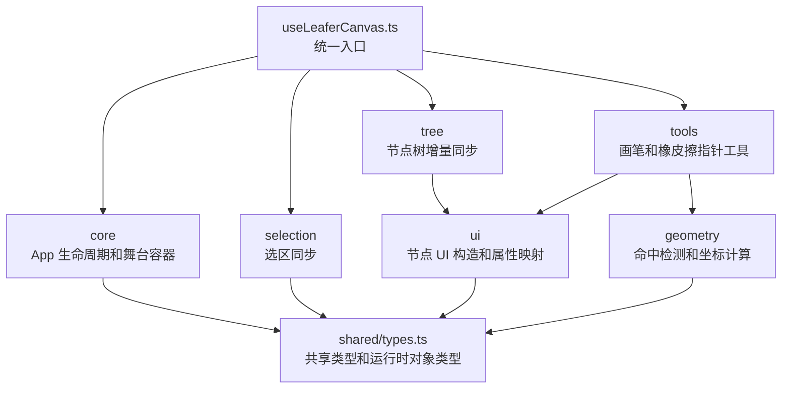
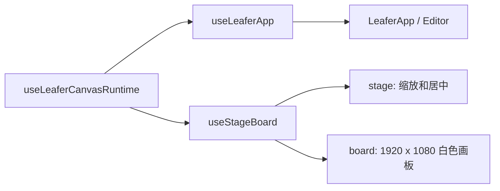
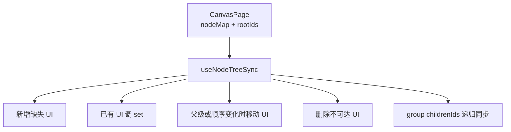
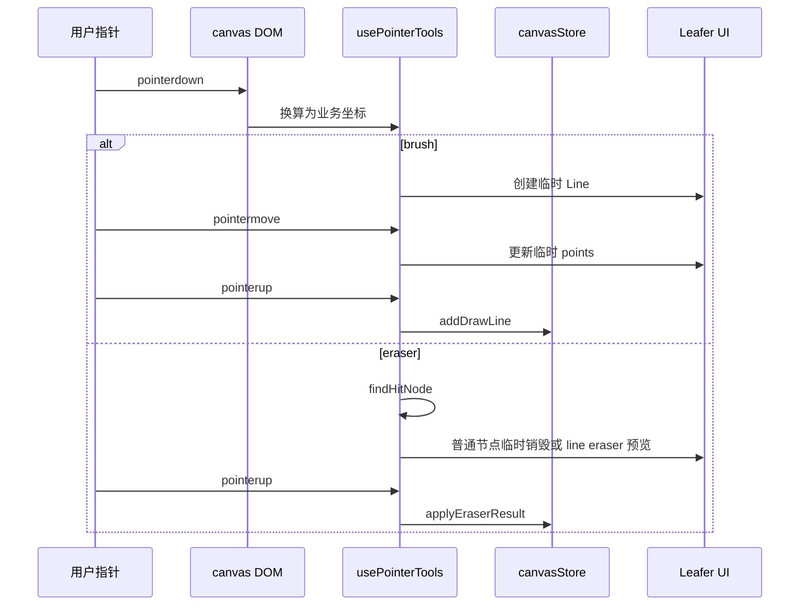
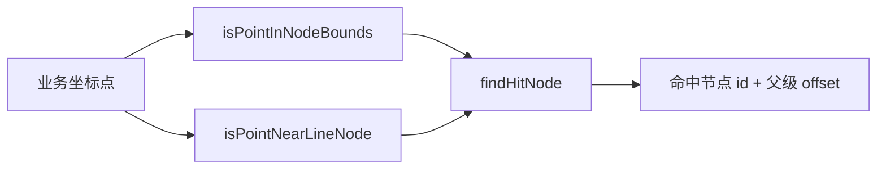
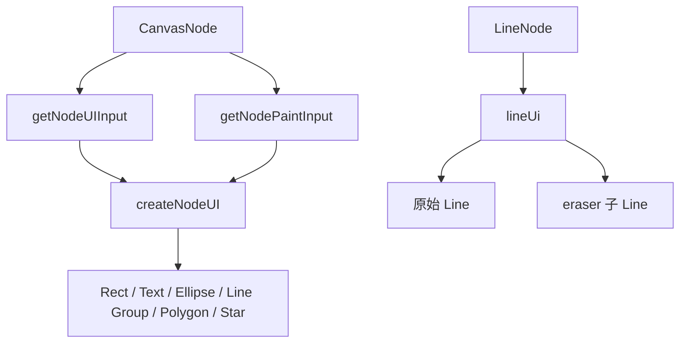
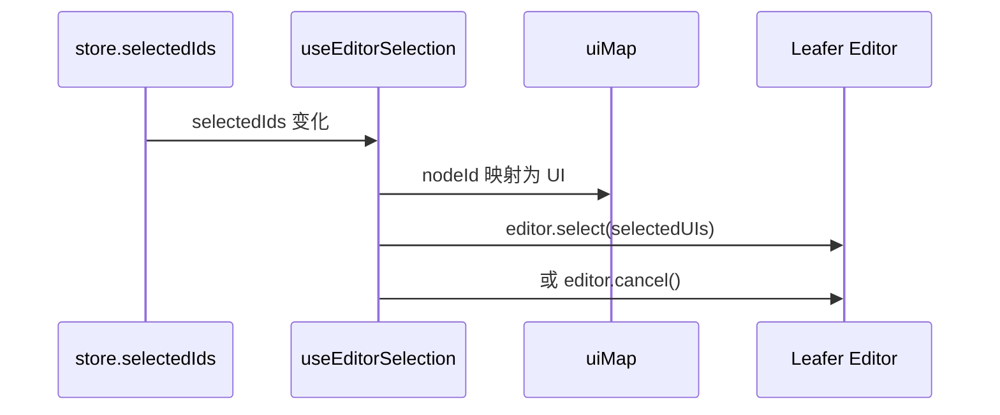
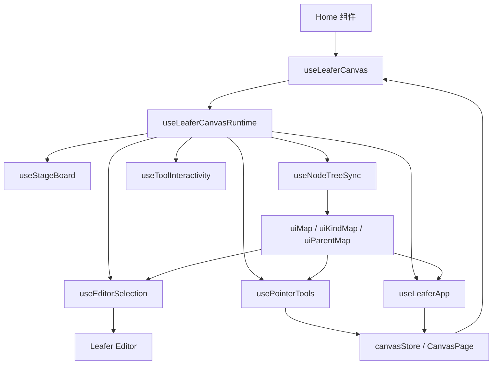

# Home Hooks 结构说明

`hooks` 目录承载 Home 页面中和 Leafer 画布绑定最紧的逻辑。当前核心入口是
`useLeaferCanvas.ts`，它只负责组装子模块，不再直接包含大量节点渲染、指针事件和
命中检测细节。

## 目录结构

```text
hooks/
  useLeaferCanvas.ts
  leaferCanvas/
    core/
      useLeaferApp.ts
      useLeaferCanvasRuntime.ts
      useStageBoard.ts
    geometry/
      hitDetection.ts
    selection/
      useEditorSelection.ts
    shared/
      types.ts
    tools/
      brush.ts
      interaction.ts
      usePointerTools.ts
    tree/
      useNodeTreeSync.ts
      useToolInteractivity.ts
    ui/
      lineUi.ts
      nodeUi.ts
      paint.ts
```

## 分层职责



### `useLeaferCanvas.ts`

这是对外唯一入口，Home 页面仍然通过：

```ts
import { useLeaferCanvas } from "./hooks/useLeaferCanvas";
```

入口职责：

- 解构当前页面的 `nodeMap`、`rootIds`、`selectedIds`、`viewport`。
- 创建共享 runtime refs。
- 调用各功能子 hook。
- 保持 `Home` 组件不感知内部拆分细节。

## `core`

`core` 负责 Leafer 实例生命周期，以及稳定舞台容器。



### `useLeaferCanvasRuntime.ts`

创建所有子模块共享的稳定 refs：

- `appRef`：LeaferApp 实例。
- `stageRef` / `boardRef`：稳定画布容器。
- `pageRef` / `toolRef`：供原生事件读取最新 React 状态。
- `uiMapRef` / `uiKindMapRef` / `uiParentMapRef`：业务节点到 Leafer UI 的增量同步索引。
- `onAddDrawLineRef` 等 callback refs：避免原生事件闭包捕获旧 store action。

### `useLeaferApp.ts`

负责创建和销毁 LeaferApp，并注册只需要绑定一次的原生事件：

- `EditorEvent.SELECT`：用户点击、框选后同步回 store。
- `DragEvent.END`：拖拽结束后把 UI 上的最新位置写回 store。
- `InnerEditorEvent.CLOSE`：文本编辑关闭后同步文本内容。

### `useStageBoard.ts`

维护稳定的 `stage` 和 `board`：

- `stage` 负责缩放和居中。
- `board` 是白色业务画板，尺寸固定按 `viewport` 渲染。
- 尺寸变化只调用 `set()`，不清空 `app.tree`，避免破坏 Editor 内部层。

## `tree`

`tree` 负责把业务节点树同步成 Leafer UI 树。



### `useNodeTreeSync.ts`

核心原则：

- 新增节点只创建对应 UI。
- 已有节点只更新属性，不重建整个画布。
- `rootIds` / `childrenIds` 顺序变化只移动 UI。
- group / ungroup 只移动父容器。
- 不再使用 `app.tree.clear()`。

### `useToolInteractivity.ts`

根据工具模式切换节点可编辑性：

- `select`：恢复 `editable` 和 `draggable`，交给 Leafer Editor。
- `brush` / `eraser`：关闭 `editable` 和 `draggable`，避免 Editor hover 框和自定义工具冲突。

## `tools`

`tools` 负责自定义工具交互。



### `usePointerTools.ts`

接管 `brush` 和 `eraser` 的完整 pointer 手势：

- `pointerdown` 只绑定在 canvas DOM 上。
- `pointermove` / `pointerup` 绑定到 `window`，保证拖出画布也能结束手势。
- brush 过程中只更新临时 Line，松手后一次性写 store。
- eraser 对普通节点执行整节点擦除；对 line 节点写入局部 `eraserPaths`。

### `brush.ts`

负责把 brush 采样到的全局点归一化为 `LineNode` 输入：

- `node.x` / `node.y` 是外接矩形左上角。
- `node.width` / `node.height` 是外接矩形尺寸。
- `points` 转换为相对节点自身的局部坐标。

### `interaction.ts`

封装选择修饰键判断：

- 支持 `ctrlKey`、`metaKey`、`shiftKey`。
- 同时兼容 Leafer 事件直接字段和 `origin` 原始 DOM 事件字段。

## `geometry`

`geometry` 是纯算法层，不依赖 React。



### `hitDetection.ts`

包含：

- 点到点距离。
- 点到线段距离。
- 普通节点包围盒命中。
- line 节点路径命中。
- group 递归命中。
- 全局坐标到 line 局部坐标转换。

## `ui`

`ui` 负责把业务节点转换成 Leafer UI。



### `paint.ts`

集中处理通用绘制属性：

- `fill`
- `stroke`
- `strokeWidth`
- `strokeCap`
- `strokeAlign`
- `dashPattern`

### `nodeUi.ts`

处理节点级映射：

- `getNodeUIInput`：业务节点字段到 Leafer 输入字段。
- `createNodeUI`：按节点类型创建 Leafer UI。
- `getNodePatchFromUI`：拖拽/编辑后从 Leafer UI 反读可写回 store 的字段。
- `hasNodePatchChange`：避免空 patch 进入历史栈。

### `lineUi.ts`

line 节点单独处理，因为它需要局部擦除：

- line 业务节点在 Leafer 中渲染为 `Group`。
- 原始笔迹是 group 内的底层 `Line`。
- eraser 轨迹是 group 内的上层 `Line`，使用 Leafer 的 `eraser: "pixel"`。
- `eraserPaths` 会在同步时重建为持久 eraser 子节点。

## `selection`

`selection` 负责 store 到 Leafer Editor 的选区同步。



### `useEditorSelection.ts`

只处理一个方向：

```text
store.selectedIds -> Leafer Editor
```

反方向：

```text
Leafer Editor -> store.selectedIds
```

由 `core/useLeaferApp.ts` 中的 `EditorEvent.SELECT` 处理。这样可以避免选区同步逻辑互相嵌套。

## 数据流总览



## 维护约定

- 新增节点类型时，优先改 `ui/nodeUi.ts`，必要时同步 `worker/thumbnail` 渲染逻辑。
- 新增命中规则时，优先改 `geometry/hitDetection.ts`，避免把算法散落到 React hook 中。
- 新增工具模式时，优先在 `tools/` 下拆独立文件，再由 `usePointerTools` 组合。
- 修改 App 生命周期或 Editor 原生事件时，只改 `core/useLeaferApp.ts`。
- 不要在任何模块里调用 `app.tree.clear()`；只维护本项目创建的 stage / board / node UI。
