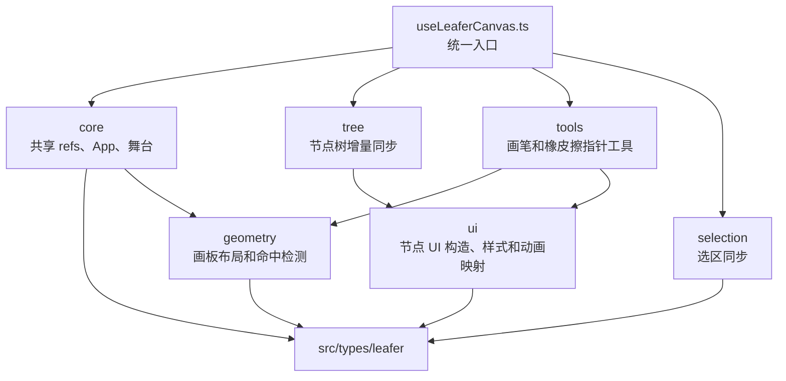
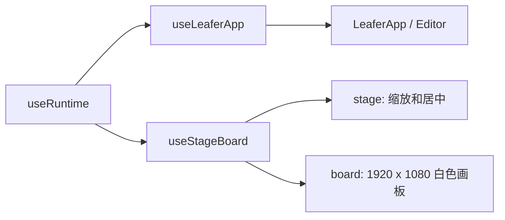
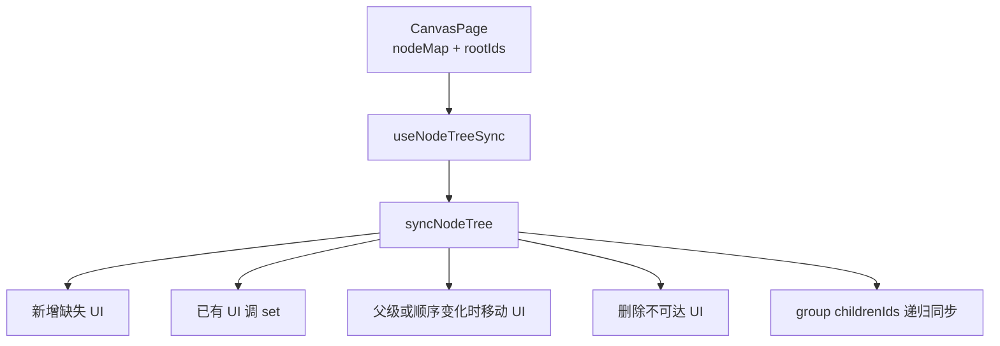
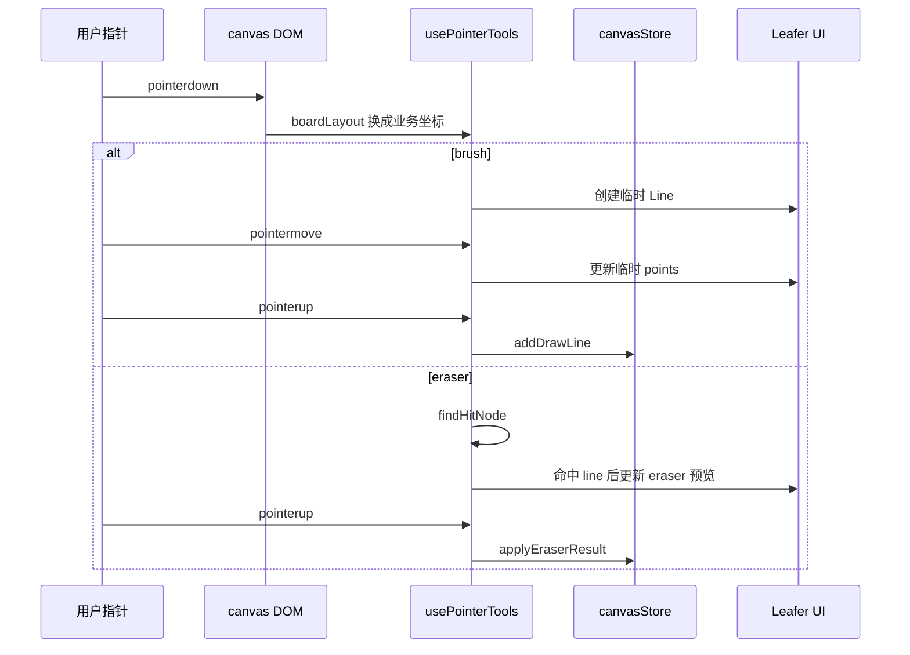
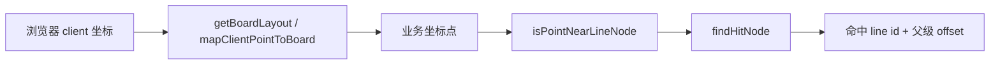
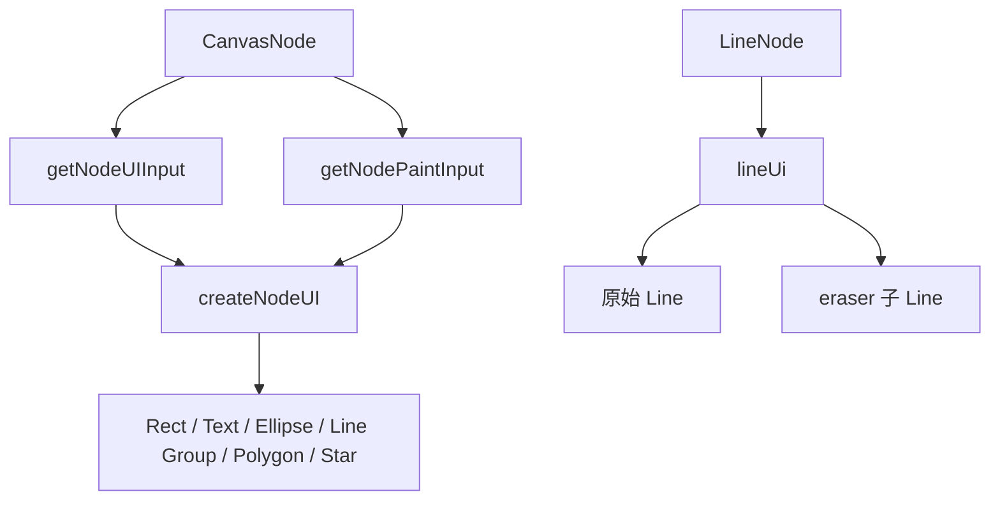
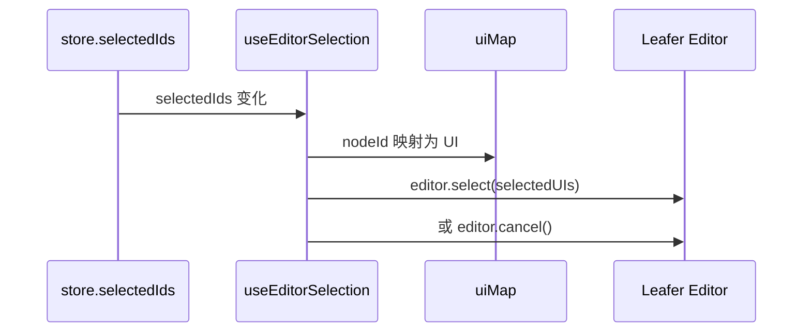
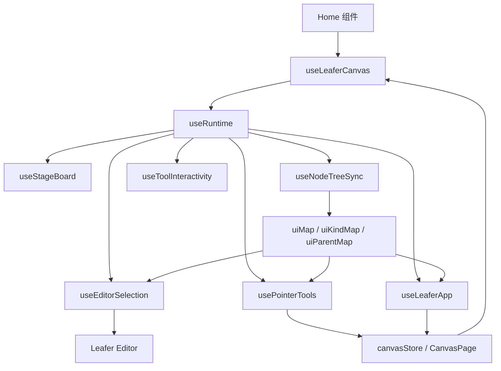

# Home Hooks 结构说明

`hooks` 目录承载 Home 页面中和 Leafer 画布绑定最紧的逻辑。当前核心入口是
`useLeaferCanvas.ts`，它只负责组装子模块，不再直接包含大量节点渲染、指针事件和
命中检测细节。增量同步为什么不能 `app.tree.clear()`、选区如何防回环，见
`docs/useLeaferCanvas-logic.md`。

## 目录结构

```text
hooks/
  README.md
  useLeaferCanvas.ts
  leaferCanvas/
    core/
      useLeaferApp.ts
      useRuntime.ts
      useStageBoard.ts
    geometry/
      boardLayout.ts
      hitDetection.ts
    selection/
      useEditorSelection.ts
    tools/
      additiveSelect.ts
      brush.ts
      eraser.ts
      usePointerTools.ts
    tree/
      syncNodeTree.ts
      useNodeTreeSync.ts
      useToolInteractivity.ts
    ui/
      animation.ts
      imageUi.ts
      lineUi.ts
      nodeUi.ts
      paint.ts
      uiMap.ts
```

## 分层职责


```mermaid
flowchart TD
  Entry[useLeaferCanvas.ts<br/>统一入口] --> Core[core<br/>共享 refs、App、舞台]
  Entry --> Tree[tree<br/>节点树增量同步]
  Entry --> Tools[tools<br/>画笔和橡皮擦指针工具]
  Entry --> Selection[selection<br/>选区同步]

  Core --> Types[src/types/leafer]
  Tree --> UI[ui<br/>节点 UI 构造、样式和动画映射]
  Core --> Geometry[geometry<br/>画板布局和命中检测]
  Tools --> Geometry
  Tools --> UI
  Selection --> Types
  UI --> Types
  Geometry --> Types
```

### `useLeaferCanvas.ts`

这是对外唯一入口，Home 页面仍然通过：

```ts
import { useLeaferCanvas } from "./hooks/useLeaferCanvas";
```

入口职责：

- 解构当前页面的 `nodeMap`、`rootIds`、`selectedIds`、`viewport`。
- 调用 `useRuntime` 创建共享 refs。
- 组装 `useLeaferApp`、`useStageBoard`、`useNodeTreeSync`、`usePointerTools`、`useToolInteractivity`、`useEditorSelection`。
- 保持 `Home` 组件不感知内部拆分细节。

## `core`

`core` 负责共享 refs、Leafer 实例生命周期，以及稳定舞台容器。


```mermaid
flowchart LR
  Runtime[useRuntime] --> App[useLeaferApp]
  Runtime --> Stage[useStageBoard]
  App --> LeaferApp[LeaferApp / Editor]
  Stage --> StageNode[stage: 缩放和居中]
  Stage --> BoardNode[board: 1920 x 1080 白色画板]
```

### `useRuntime.ts`

创建所有子模块共享的稳定 refs：

- `appRef`：LeaferApp 实例。
- `stageRef` / `boardRef`：稳定画布容器。
- `drawingRef`：brush / eraser 手势进行中的临时状态。
- `isSyncingEditorSelectionRef`：程序化 select/cancel 时屏蔽 SELECT 回写。
- `pageRef` / `toolRef`：供原生事件读取最新 React 状态。
- `uiMapRef` / `uiKindMapRef` / `uiParentMapRef`：业务节点到 Leafer UI 的增量同步索引。
- `onAddDrawLineRef` 等 callback refs：避免原生事件闭包捕获旧 store action。

### `useLeaferApp.ts`

负责创建和销毁 LeaferApp，并注册只需要绑定一次的原生事件：

- `EditorEvent.SELECT`：用户点击、框选后同步回 store；UI 反查 nodeId 走 `ui/uiMap.ts`。
- `DragEvent.END`：拖拽结束后把 UI 上的最新位置写回 store。
- `InnerEditorEvent.CLOSE`：文本编辑关闭后同步文本内容。
- 卸载时 `disposeAllImageSources`，再 `app.destroy()`，并清空 uiMap 等索引。

### `useStageBoard.ts`

维护稳定的 `stage` 和 `board`：

- `stage` 的缩放和居中偏移来自 `geometry/boardLayout.ts`，与指针反算同一套公式。
- `board` 是白色业务画板，尺寸固定按 `viewport` 渲染。
- 尺寸变化只调用 `set()`，不清空 `app.tree`，避免破坏 Editor 内部层。
- 缩放变化后下一帧刷新 Editor 选区框。

## `tree`

`tree` 负责把业务节点树同步成 Leafer UI 树。


```mermaid
flowchart TD
  Store[CanvasPage<br/>nodeMap + rootIds] --> Hook[useNodeTreeSync]
  Hook --> Sync[syncNodeTree]
  Sync --> Create[新增缺失 UI]
  Sync --> Update[已有 UI 调 set]
  Sync --> Move[父级或顺序变化时移动 UI]
  Sync --> Remove[删除不可达 UI]
  Sync --> Group[group childrenIds 递归同步]
```

### `useNodeTreeSync.ts`

hook 只在 `board` 就绪后调用 `syncCanvasPageToLeafer`。核心原则：

- 新增节点只创建对应 UI。
- 已有节点只更新属性，不重建整个画布。
- `rootIds` / `childrenIds` 顺序变化只移动 UI。
- group / ungroup 只移动父容器。
- 不再使用 `app.tree.clear()`。

### `syncNodeTree.ts`

增量同步的纯逻辑：创建 / `set` / 换父级 / 按 index 重排 / 销毁不可达 UI。事件闭包只捕获 `nodeId`，拖拽结束从 `pageRef` 读最新节点。

### `useToolInteractivity.ts`

根据工具模式切换节点可编辑性：

- `select`：恢复 `editable` 和 `draggable`，交给 Leafer Editor。
- `brush` / `eraser`：关闭 `editable` 和 `draggable`，避免 Editor hover 框和自定义工具冲突。

## `tools`

`tools` 负责自定义工具交互。


```mermaid
sequenceDiagram
  participant User as 用户指针
  participant DOM as canvas DOM
  participant Tools as usePointerTools
  participant Store as canvasStore
  participant Leafer as Leafer UI

  User->>DOM: pointerdown
  DOM->>Tools: boardLayout 换成业务坐标
  alt brush
    Tools->>Leafer: 创建临时 Line
    User->>Tools: pointermove
    Tools->>Leafer: 更新临时 points
    User->>Tools: pointerup
    Tools->>Store: addDrawLine
  else eraser
    Tools->>Tools: findHitNode
    Tools->>Leafer: 命中 line 后更新 eraser 预览
    User->>Tools: pointerup
    Tools->>Store: applyEraserResult
  end
```

### `usePointerTools.ts`

接管 `brush` 和 `eraser` 的完整 pointer 手势：

- `pointerdown` 只绑定在 canvas DOM 上。
- `pointermove` / `pointerup` 绑定到 `window`，保证拖出画布也能结束手势。
- client 坐标经 `getBoardLayout` / `mapClientPointToBoard` 换成 1920×1080 业务坐标。
- brush 过程中只更新临时 Line，松手后一次性写 store。
- eraser 只擦 `line` 节点，写入局部 `eraserPaths`；矩形、椭圆、文本等图形不参与擦除。

### `brush.ts`

负责把 brush 采样到的全局点归一化为 `LineNode` 输入：

- `node.x` / `node.y` 是外接矩形左上角。
- `node.width` / `node.height` 是外接矩形尺寸。
- `points` 转换为相对节点自身的局部坐标。

### `eraser.ts`

橡皮擦手势的纯函数：命中 line、更新临时预览路径、松手时生成 `eraserPaths` 提交数据。

### `additiveSelect.ts`

判断点击是否追加/切换选择（Ctrl / Meta / Shift），兼容 Leafer 事件字段和 `origin` 上的 DOM 修饰键。节点 UI 的 `tap`（`syncNodeTree`）会用到它，不只是工具栏。

## `geometry`

`geometry` 是纯算法层，不依赖 React。


```mermaid
flowchart LR
  Client[浏览器 client 坐标] --> Layout[getBoardLayout / mapClientPointToBoard]
  Layout --> Point[业务坐标点]
  Point --> LineHit[isPointNearLineNode]
  LineHit --> Hit[findHitNode]
  Hit --> Result[命中 line id + 父级 offset]
```

### `boardLayout.ts`

stage 缩放居中和指针反算共用：

- `getBoardLayout`：按容器宽高算出 `scale`、`boardX`、`boardY`。
- `mapClientPointToBoard`：client 坐标换成画板坐标；落在白板外返回 `undefined`。

改缩放规则只改这里，避免舞台和画笔对不齐。

### `hitDetection.ts`

包含：

- 点到点距离。
- 点到线段距离。
- line 节点路径命中。
- group 递归命中，非 line 图形跳过。
- 全局坐标到 line 局部坐标转换。

## `ui`

`ui` 负责把业务节点转换成 Leafer UI。


```mermaid
flowchart TD
  CanvasNode[CanvasNode] --> NodeInput[getNodeUIInput]
  CanvasNode --> Paint[getNodePaintInput]
  NodeInput --> Create[createNodeUI]
  Paint --> Create
  Create --> LeaferUI[Rect / Text / Ellipse / Line Group / Polygon / Star]
  LineNode[LineNode] --> LineUI[lineUi]
  LineUI --> Content[原始 Line]
  LineUI --> Eraser[eraser 子 Line]
```

### `paint.ts`

集中处理通用绘制属性：

- `fill`
- `stroke`
- `strokeWidth`
- `strokeCap`
- `strokeAlign`
- `dashPattern`

### `animation.ts`

把节点 `animationList` 转成 Leafer `animation`：

- 面板时长/延时是毫秒，Leafer 使用秒。
- 多条动画按列表顺序依次开始。
- 创建节点时写入 animation；后续增量同步只有配置变化才重写，避免拖拽打断播放。

### `nodeUi.ts`

处理节点级映射：

- `getNodeUIInput`：业务节点字段到 Leafer 输入字段。
- `createNodeUI`：按节点类型创建 Leafer UI。
- `getNodePatchFromUI`：拖拽/编辑后从 Leafer UI 反读可写回 store 的字段。
- `hasNodePatchChange`：避免空 patch 进入历史栈。

### `lineUi.ts`

line 节点单独处理，因为它需要局部擦除：

- line 业务节点在 Leafer 中渲染为 `Group`。
- 原始笔迹是 group 内的底层 `Line`。
- eraser 轨迹是 group 内的上层 `Line`，使用 Leafer 的 `eraser: "pixel"`。
- `eraserPaths` 会在同步时重建为持久 eraser 子节点。

### `imageUi.ts`

图片节点走 `src/worker/image-cache`：`getImageBlob` → `createObjectURL` → Leafer `Image.url`。换 `src` 或销毁前先清空 url 再 `revokeObjectURL`。

### `uiMap.ts`

`findNodeIdByUI`：Editor 事件给的是 UI 实例，用托管 `uiMap` 反查业务 `nodeId`。

## `selection`

`selection` 负责 store 到 Leafer Editor 的选区同步。


```mermaid
sequenceDiagram
  participant Store as store.selectedIds
  participant Hook as useEditorSelection
  participant Map as uiMap
  participant Editor as Leafer Editor

  Store->>Hook: selectedIds 变化
  Hook->>Map: nodeId 映射为 UI
  Hook->>Editor: editor.select(selectedUIs)
  Hook->>Editor: 或 editor.cancel()
```

### `useEditorSelection.ts`

只处理一个方向：

```text
store.selectedIds -> Leafer Editor
```

反方向：

```text
Leafer Editor -> store.selectedIds
```

由 `core/useLeaferApp.ts` 中的 `EditorEvent.SELECT` 处理。这样可以避免选区同步逻辑互相嵌套。

## 数据流总览


```mermaid
flowchart TD
  Home[Home 组件] --> Entry[useLeaferCanvas]
  Entry --> Runtime[useRuntime]
  Runtime --> App[useLeaferApp]
  Runtime --> Stage[useStageBoard]
  Runtime --> Tree[useNodeTreeSync]
  Runtime --> Tool[usePointerTools]
  Runtime --> Mode[useToolInteractivity]
  Runtime --> Selection[useEditorSelection]

  Store[canvasStore / CanvasPage] --> Entry
  Tree --> UIMap[uiMap / uiKindMap / uiParentMap]
  UIMap --> Selection
  UIMap --> Tool
  UIMap --> App

  Tool --> Store
  App --> Store
  Selection --> Editor[Leafer Editor]
```

## 维护约定

- 新增节点类型时，优先改 `ui/nodeUi.ts`，必要时同步 `worker/page-thumbnail` 渲染逻辑。
- 图片节点：主画布 Leafer 和缩略图都通过 `src/worker/image-cache` 加载 `src`；素材面板只负责把 URL 写入节点，自己不请求图片。
- 新增命中规则时，优先改 `geometry/hitDetection.ts`，避免把算法散落到 React hook 中。
- 改舞台缩放或指针坐标换算时，只改 `geometry/boardLayout.ts`。
- 新增工具模式时，优先在 `tools/` 下拆独立文件（与 `brush.ts` / `eraser.ts` 平行命名），再由 `usePointerTools` 组合。
- 修改 App 生命周期或 Editor 原生事件时，只改 `core/useLeaferApp.ts`；共享 refs 只改 `core/useRuntime.ts`。
- Leafer hook / UI 运行时类型放在 `src/types/leafer`，不要在 `leaferCanvas` 下再建 `shared` 类型目录。
- 不要在任何模块里调用 `app.tree.clear()`；只维护本项目创建的 stage / board / node UI。
- 原理和历史坑见 `docs/useLeaferCanvas-logic.md`；改完本目录结构后同步根 `README.md`。
