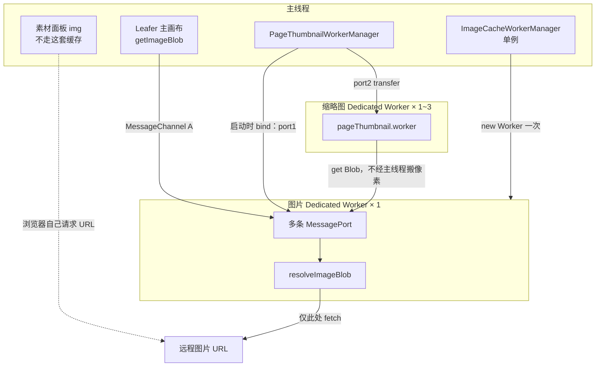
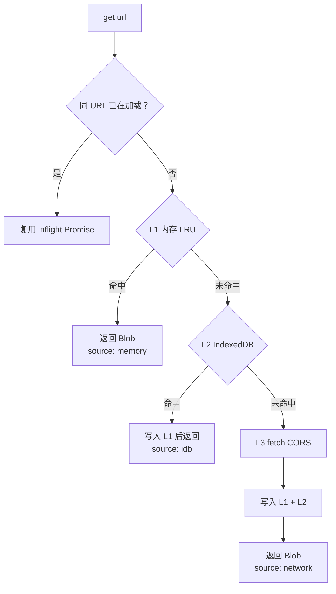

# 图片资源缓存线程

制作页的主画布（Leafer，主线程）和底部缩略图（最多 3 个 Dedicated Worker）都可能需要同一张远程图。如果各自 `fetch` / 解码，同 URL 会打多次网络，HTTP 缓存也不保证跨线程、跨 `` 与 `fetch` 命中。

本目录实现一个**单独的 Dedicated Worker**，专门负责图片请求和三级缓存。主线程和缩略图 worker **都不自己请求图片 URL**，只通过 `MessagePort` 向它要 `Blob`。

不使用 Service Worker，也不使用 SharedWorker。

## 线程关系

主线程创建**一个**图片 Dedicated Worker（会话内常驻），再用 `MessageChannel` 把 port 分给自己和每个缩略图 worker。



缩略图 worker **不能**再 `new Worker` 去连图片线程（Dedicated Worker 一对一）。必须由主线程创建 `MessageChannel` 并把两端 port 分别转交。缩略图要图时走直连 port，**像素不会先回到主线程再转发**。

图片线程不随缩略图 `terminate()` 一起关掉，避免主画布还在用缓存。

## 三级缓存（全部在图片线程内部）

同一 URL 的并发请求会合并成一次加载（inflight map）。




1. **L1 内存 LRU**：`Map` 保存 `Blob`。命中时把条目挪到最新；超出条目数或总字节则淘汰最旧。只活在图片线程里，刷新页面会丢。
2. **L2 IndexedDB**：同源共享，库名 `paint-canvas-image-blobs`。刷新后仍可用。命中后提升到 L1，并更新 `lastAccessedAt`。超限按访问时间淘汰。
3. **L3 网络**：`fetch`。默认 `cache: "default"`、`credentials: "omit"`、`mode: "cors"`，可通过 `getImageBlob(url, fetchInit)` 覆盖。成功后再写入 L1 和 L2。浏览器 HTTP 缓存仍可作为这次 fetch 的底层优化。

单张图大于 L1 / L2 上限时跳过对应层，避免一块超大图挤掉整个缓存。

## 回传约定与开销

`postMessage` 的协议消息（`{ type: "get", url }`）开销可忽略。贵的是把图搬过去：

- 缓存线程 **L1/L2 存 Blob，回传也用 Blob，且不 transfer**。多数引擎只克隆句柄，不拷像素；发送方继续持有缓存。
- 不要回传未 transfer 的 `ImageBitmap` / `ArrayBuffer`（会整份拷像素）。
- 不要把已发出的 `ImageBitmap` 放进 L1（transfer 后发送方就没了）。
- 解码（`createImageBitmap` / `HTMLImageElement` / Leafer fill）发生在**真正画画的那条线程**，同一 Blob 可能被主画布和缩略图各解一次，这比跨线程搬位图更可控。

主画布拿到 Blob 后可 `URL.createObjectURL` 或建成图片再交给 Leafer；缩略图 worker 可 `createImageBitmap(blob)` 后 `drawImage`。

## 调用方式

主线程：

```ts
import { getImageBlob } from "@/worker/image-cache";

const { blob, source } = await getImageBlob(url);
const { blob: noStoreBlob } = await getImageBlob(url, { cache: "no-store" });
```

缩略图 worker：收到 `bind-image-cache` 后用 `ImageCachePortClient` 调 `getBlob`。渲染前按页面收集图片节点 `src`，先要齐 Blob 再画。素材面板只写入 URL，不经过这套缓存。

## 目录

```text
image-cache/
  types.ts                 跨线程消息协议（bind / get / result）
  client.ts                MessagePort 客户端（主线程、缩略图 worker 共用）
  workerManager.ts         主线程单例：创建 worker、转交 port、getImageBlob
  imageCache.worker.ts     图片 Dedicated Worker：收 port、调缓存层
  cache/
    limits.ts              L1 / L2 容量
    memoryLru.ts           L1 Blob LRU
    idb.ts                 L2 IndexedDB
    resolveBlob.ts         L1 → L2 → fetch，合并 inflight
    index.ts
  index.ts                 主线程对外入口
```

缩略图侧配套：`src/worker/page-thumbnail/images.ts`（收集页面图片 URL、取 Blob、解码、释放）。缩略图 worker 只从 `image-cache/client.ts` 和 `image-cache/types.ts` 引用，避免把 `workerManager`（`new Worker`）打进缩略图包。

## 维护约定

- 主线程、缩略图 worker、其它 worker 都不要对图片 URL 自行 `fetch`。
- 新增图片节点时：Leafer fill 走 `getImageBlob`；`worker/page-thumbnail` 用已绑定的 client 取同一 URL。
- 不要把这套缓存改回 Service Worker 拦截；制作页默认不注册 SW。
